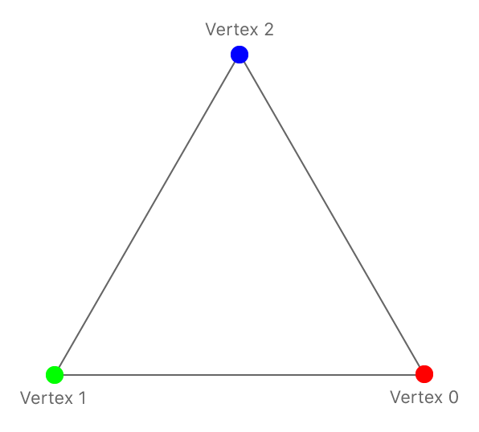
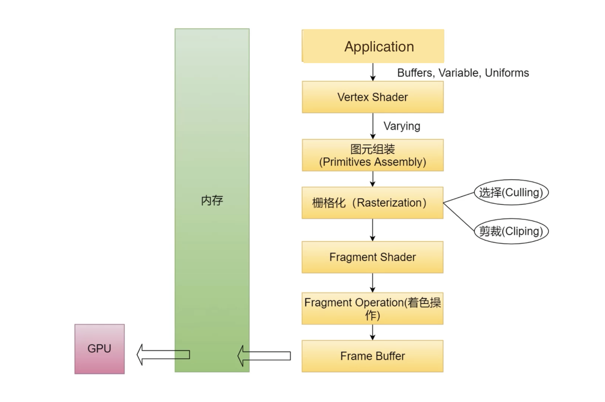
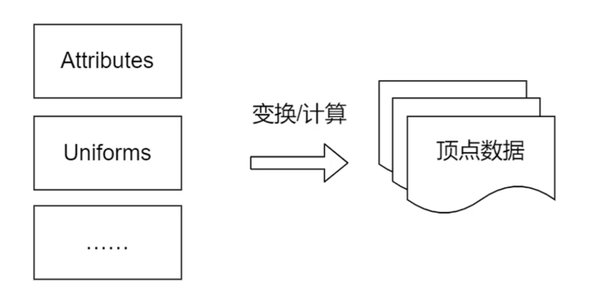
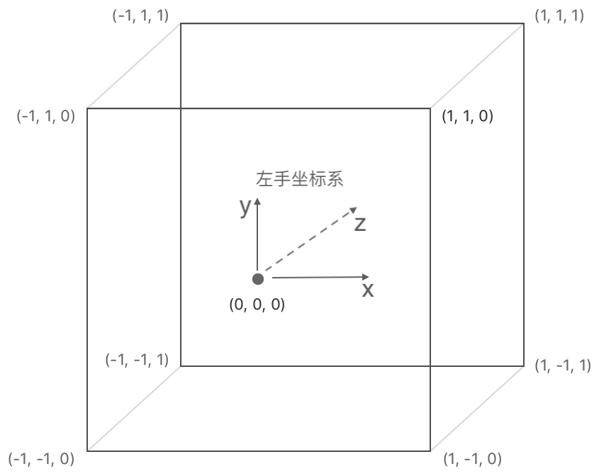
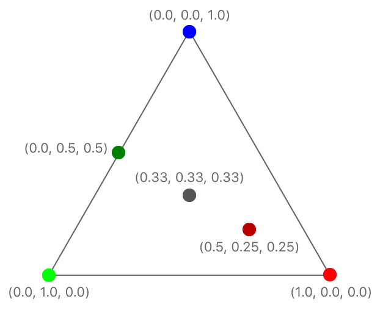

# 使用 Metal 绘制三角形

[使用 Metal 绘制一个二维三角形](https://developer.apple.com/documentation/metal/using_a_render_pipeline_to_render_primitives)




# 1、Metal 的渲染管道

绘制图形需要对数据映射、变换等处理，将这一系列的步骤抽象成 __渲染管道__ ！



渲染管道有许多阶段：
* 应用层的数据传递到顶点着色器 `Vertex Shader` ；
* 顶点着色器 `Vertex Shader` 采用控制反转，将数据的处理交给开发者；
顶点着色器计算每个顶点的最终坐标，然后将计算好的数据注入渲染管道；
* 接着进入图元组装 `Primitives Assembly`，将位置、索引等信息组成三角形；
* 栅格化 `Rasterization` 将三角形映射到  `Fragment`；栅格化可以对图元做 `Cull`、 `Clip`等操作；
* 经过栅格化之后，三角形就变成了  `Fragment`；此时通过程序反转，让开发者调用 `Fragment Shader`，为每一个  `Fragment` 上色；
* 开发者为每个  `Fragment` 上色之后，交由  `Fragment Operation` 着色；
*  `Fragment Operation` 根据深度做出取舍，被遮挡的部分不会显示；或者颜色混合；
*  最后形成一个  `Frame Buffer`，写到内存中； 
* GPU 从内存中读取  `Frame Buffer` 显示一帧图像；


Metal 的渲染管道主要侧重于三个阶段：
* 顶点着色器  `Vertex Shader` ：转换坐标；
* 光栅化阶段  `Rasterization`  ：将三角形映射到  `Fragment`，并进行 `Cull`、 `Clip` 等操作；
* 片段着色器  `Fragment Shader` ：为 `Fragment` 设置颜色；

开发者可以为  `Vertex Shader`  与  `Fragment Shader` 编写  `MSL` 函数！

* `Metal Shading Language` 是 C++ 的一种变体，专为 GPU 编程而设计，要在 GPU 上执行计算，需要使用 MSL 函数；
* 在 Metal 中，在 GPU 上运行的代码称为 __着色器__；


渲染从绘制命令开始，其中包括顶点计数和要渲染的图元类型。

```
/// 绘制三角形
[renderEncoder drawPrimitives:MTLPrimitiveTypeTriangle
                  vertexStart:0
                  vertexCount:3];
```

顶点着色器为每个顶点提供数据，当处理了足够多的顶点后，渲染管道会光栅化图元，确定渲染目标中的哪些像素位于图元的边界内。
片段着色器确定要写入这些像素的渲染目标的值。

该示例将演示如何编写顶点和片段函数、如何创建渲染管道、如何使用绘制命令进行编码。


## 1.1、自定义渲染管道处理数据

顶点函数为单个顶点生成数据，片段函数为单个片段生成数据，开发者可以在顶点着色器或者片段着色器决定管道生成什么以及它如何生成这些结果。

决定将哪些数据传递到渲染管道以及将哪些数据传递到管道的后期阶段。通常可以在三个地方执行此操作：

* 管道的输入，由应用程序提供并传递到顶点着色器；
* 顶点着色器的输出，传递到光栅化阶段；
* 片段着色器的输入，由应用程序提供或由光栅化阶段生成；

在本例中，管道的输入数据包含三角形顶点位置以及颜色（注意：坐标需要适配 Metal 坐标系）。

```
#include <simd/simd.h>

/// 定义输入数据的类型为 SIMD 类型 
typedef struct {
    vector_float2 position; /// 顶点位置
    vector_float4 color;    /// 颜色
} AAPLVertex;
```

SIMD 类型在 Metal Shading Language 中很常见，该类型包含特定数据类型的多个通道
* 位置有 x 和 y 坐标，有两个 32 位浮点值，声明类型为 `vector_float2` ；
* 颜色有四个通道：`red`、`green`、`blue`、`alpha`，使用 `vector_float4` 存储；

```
/// 使用常量数组指定输入的三角形数据
static const AAPLVertex triangleVertices[] =
{
    //    2D (x,y)          RGBA 
    { {  250,  -250 }, { 1, 0, 0, 1 } },
    { { -250,  -250 }, { 0, 1, 0, 1 } },
    { {    0,   250 }, { 0, 0, 1, 1 } },
};
```

顶点着色器需要生成顶点数据，因此需要提供颜色和变换位置；使用 SIMD 类型声明一个包含位置和颜色值的结构

``` .metal 文件
/// 顶点着色器输出，碎片着色器输入
struct RasterizerData {

    /// 经过顶点着色器处理之后，顶点的剪辑空间位置
    /// Metal 没有对结构中的字段命名有特定约定，需要开发者告诉 Metal 光栅化数据中的哪个字段提供位置数据
    /// 属性限定符 [[position]] 声明 position 字段保存输出位置
    /// 位置信息必须定义为 vector_float4
    float4 position [[position]]; 
    float4 color; /// 栅格化阶段处理之后，将该值传递到片段着色器
};
```

片段函数只是将光栅化阶段的数据传递给后面的阶段，因此它不需要任何额外的参数。


## 1.2、顶点着色器



* 每次调用顶点函数产生一个顶点数据；
* 如果有很多顶点需要计算，显卡有很多核，可以并行计算；

``` .metal 文件
/**  使用关键字 vertex 声明顶点着色器
 * @param vertexID 使用属性限定符 [vertex_id]]，这是另一个 Metal 关键字；
 *        执行渲染命令时，GPU 会多次调用顶点函数，为每个顶点生成一个唯一值；
 * @param vertices 包含顶点数据的数组
 * @param viewportSizePointer 为了将传入位置转换为Metal的坐标，需要计算三角形的 viewport 的大小(以像素为单位)，
 *                            计算结果被存储在 viewportSizePointer 参数中；
 * @return 返回结构体 RasterizerData
 * @note 默认情况下，Metal 自动在参数表中为每个参数分配 slots；
 *       参数 2 与参数 3 使用属性限定符 [[buffer(n)]]，显示指定 Metal 要使用哪个 slot ；
 *       显式指定 slot 可以使修改着色器更容易，而不需要改变程序代码；
 */
vertex RasterizerData
vertexShader(uint vertexID [[vertex_id]],
             constant AAPLVertex *vertices [[buffer(AAPLVertexInputIndexVertices)]],
             constant vector_uint2 *viewportSizePointer [[buffer(AAPLVertexInputIndexViewportSize)]]) {
    
    RasterizerData out; // 需要生位置与颜色两个字段
    
    // 根据索引 vertexID 获取当前顶点位置，单位为像素 (即值为100表示距离原点100个像素)
    float2 pixelSpacePosition = vertices[vertexID].position.xy;    
    // 获取 viewport 大小并转换为 vector_float2
    vector_float2 viewportSize = vector_float2(*viewportSizePointer);
    
    /// 若要将像素空间中的位置转换为剪辑空间中的位置，需要像素坐标除以视口大小的一半
    out.position = vector_float4(0.0, 0.0, 0.0, 1.0);
    out.position.xy = pixelSpacePosition / (viewportSize / 2.0);
    
    // 将输入的颜色直接传递给栅格化器
    out.color = vertices[vertexID].color;
    return out;
}
```

### 1.2.1、坐标转换



使用左手坐标系作为标准坐标，并映射到 `viewport` 的位置；图元被剪切到该坐标系中的一个框 `{(-1.0，-1.0),(1.0,1.0)}` 中并栅格化。
正 z 值进入屏幕，z坐标的可见部分介于0.0(近剪切平面)和1.0(远剪切平面)之间。


```
vector_float4(x, y, z, w);
```

将输入坐标转换为左手坐标系的坐标:
* 因为这是一个 二维三角形，不需要齐次坐标系，所以输出默认坐标 `vector_float4(0.0, 0.0, 0.0, 1.0)`；
* 若要将像素空间中的位置转换为剪辑空间中的位置，还需要像素坐标除以  `viewport`  的一半；
* 使用 `SIMD` 类型执行计算，可以使用一行代码同时划分两个通道来执行除法，并将结果存储到 `x` 和 `y` 道中。

## 1.3、片段着色器

栅格化阶段会对图元进行`Cull`、`Clip`等操作，确定哪些像素被图元覆盖，像素中心在三角形内的片段才会被渲染。

* `Cull`： 选择去掉一些图元；
* `Clip`：裁剪去掉图元的某些部分；


片段着色器处理栅格化后的信息，为每个片段上色！

栅格化阶段为每个片段的参数计算值，并用它们调用片段函数。
栅格化阶段将其颜色参数计算为三角形顶点的混合颜色。
片段离顶点越近，顶点对最终颜色的贡献就越大。

``` .metal 文件
/** 使用关键字 fragment 声明片段着色器
 * @param RasterizerData 使用属性限定符 [[stage_in]] 指示数据是由栅格化器生成的
 * @return 返回处理后的渲染目标
 *         如果有多个渲染目标，需要声明一个结构体，包含所有渲染目标
 */
fragment float4 fragmentShader(RasterizerData in [[stage_in]]) {
    return in.color; // 返回插入的颜色
}
```

> 注意：片段着色器处理后的图元，并不是一定按要求渲染展示！
> 每个 Fragment 有一个深度值，存储于深度缓冲区！
> 在着色阶段，会对所有图元进行深度探测，深度更小、离用户更近的图元可能覆盖深度更大的图元！





# 2、创建渲染管道

在 `.metal` 文件中自定义顶点着色器与片段着色器之后，就可以创建渲染管道使用自定义着色器了！

首先，获取默认库并为每个着色器获取 `MTLFunction` 对象

```
// 加载默认库，获取自定义的顶点着色器、片段着色器 
id<MTLLibrary> defaultLibrary = [_device newDefaultLibrary];
id<MTLFunction> vertexFunction = [defaultLibrary newFunctionWithName:@"vertexShader"]; 
id<MTLFunction> fragmentFunction = [defaultLibrary newFunctionWithName:@"fragmentShader"];
```

接下来，创建渲染管道 `MTLRenderPipelineState` ，使用 `MTLRenderPipelineDescriptor` 来配置渲染管道的多个阶段。

```
// 渲染管道配置项
MTLRenderPipelineDescriptor *pipelineStateDescriptor = [[MTLRenderPipelineDescriptor alloc] init];
pipelineStateDescriptor.label = @"Simple Pipeline";
pipelineStateDescriptor.vertexFunction = vertexFunction;
pipelineStateDescriptor.fragmentFunction = fragmentFunction;
pipelineStateDescriptor.colorAttachments[0].pixelFormat = mtkView.colorPixelFormat;

// 根据配置项创建一个渲染管道
_pipelineState = [_device newRenderPipelineStateWithDescriptor:pipelineStateDescriptor
                                                         error:&error];
```

除了自定义顶点着色器和片段着色器，还可以声明渲染管道中所有待渲染目标的像素格式。
像素格式 [MTLPixelFormat](https://developer.apple.com/documentation/metal/mtlpixelformat) 定义了像素数据的内存布局，对于简单的格式，该定义包括每个像素的字节数、存储在像素中的数据的通道数以及这些通道的位布局。
还需要注意渲染通道的像素格式兼容性；在本例只有一个渲染目标，并且它是由视图提供的，所以将视图的像素格式复制到渲染管道。


当Metal创建渲染管道时，管道被配置为将片段着色器输出的像素格式。
如果希望以不同的像素格式为渲染目标，则需要创建不同的渲染管道状；可以在针对不同像素格式的多个管道重用相同的着色器。


# 3、设置 `Viewport`

设置 `Viewport` ，让 Metal 知道想要绘制渲染目标的哪一部分。

```
typedef struct {
    double originX, originY, width, height, znear, zfar;
} MTLViewport;

// 设置绘制对象的区域
[renderEncoder setViewport:(MTLViewport){0.0, 0.0, _viewportSize.x, _viewportSize.y, 0.0, 1.0 }];
```

# 4、设置渲染管道状态

设置需要绘制的渲染管道。

```
[renderEncoder setRenderPipelineState:_pipelineState];
```

# 5、将参数数据发送到顶点着色器

一般使用缓冲区 `MTLBuffer` 将数据传递给着色器。然而，当向顶点着色器传递少量数据时，可以直接将数据复制到缓冲区中。

```
/// 本例的数据量小，直接复制
[renderEncoder setVertexBytes:triangleVertices /// 顶点数据是从数组中复制
                       length:sizeof(triangleVertices)
                      atIndex:AAPLVertexInputIndexVertices];

[renderEncoder setVertexBytes:&_viewportSize /// viewport 数据是从设置 viewport 的相同变量中复制
                       length:sizeof(_viewportSize)
                      atIndex:AAPLVertexInputIndexViewportSize];
```

在该示例中，片段着色器只使用它从光栅化器接收到的数据，所以没有参数要设置。


# 6、编码绘图命令

指定图元的种类、起始索引和顶点的数量。
当三角形被渲染时，顶点着色器将被调用，参数 `vertexID` 的值为 `0`，`1` 和 `2`。

```
// Draw the triangle.
[renderEncoder drawPrimitives:MTLPrimitiveTypeTriangle
                  vertexStart:0
                  vertexCount:3];
```

编码结束，将命令提交缓冲区。还可以使用同一组步骤编码更多的呈现命令。
最终的图像呈现为命令是按照指定的顺序处理的。(为了提高性能，GPU允许并行处理命令甚至部分命令，只要最终结果看起来是按顺序呈现的。)

# 7、尝试颜色插值


在该示例中颜色值被插入到三角形中，但有时需要一个值由一个顶点生成并且在整个图元中保持恒定。
为此，在顶点着色器的输出上指定属性限定符 `flat`。

```
float4 color [[flat]];
```

此时渲染管道使用来自第一个顶点(称为激发顶点)的颜色值均匀地穿过三角形，它忽略来自其他两个顶点的颜色。
可以混合使用平面阴影值和插值值，只需在顶点函数的输出中添加或省略平面限定符。
