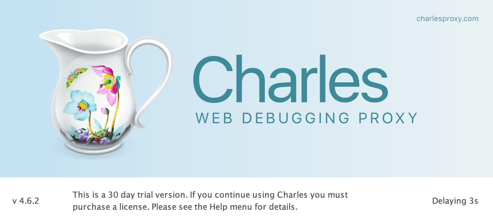

[Charles](https://www.charlesproxy.com/)  是一个 HTTP 代理/HTTP 监视器/反向代理，它使开发人员能够查看客户和服务器之间的 HTTP 数据、 SSL/HTTPS 数据。这包括请求数据、响应数据其中包含 cookie 和缓存信息）。


iPhone 连接不上 Charles

问题：Mac 通过 Wifi 连接公司网络，iPhone 进行相关的网络代理设置；但 iPhone 连接不上 Charles ，Charles 没有弹出提示框询问是不是可以访问手机！
尝试：`ping` 手机发现网络不通。

```
/// ping 手机 IP
MacBook-Pro $ ping 10.10.10.10
PING 10.10.10.10 (10.10.10.10): 56 data bytes
Request timeout for icmp_seq 0
Request timeout for icmp_seq 1
Request timeout for icmp_seq 2
Request timeout for icmp_seq 3
ping: sendto: No route to host
Request timeout for icmp_seq 4
ping: sendto: Host is down
Request timeout for icmp_seq 5
ping: sendto: Host is down
```

解决： PC 端使用网线连接后可以 `ping` 通，Charles 可以连接上手机！
