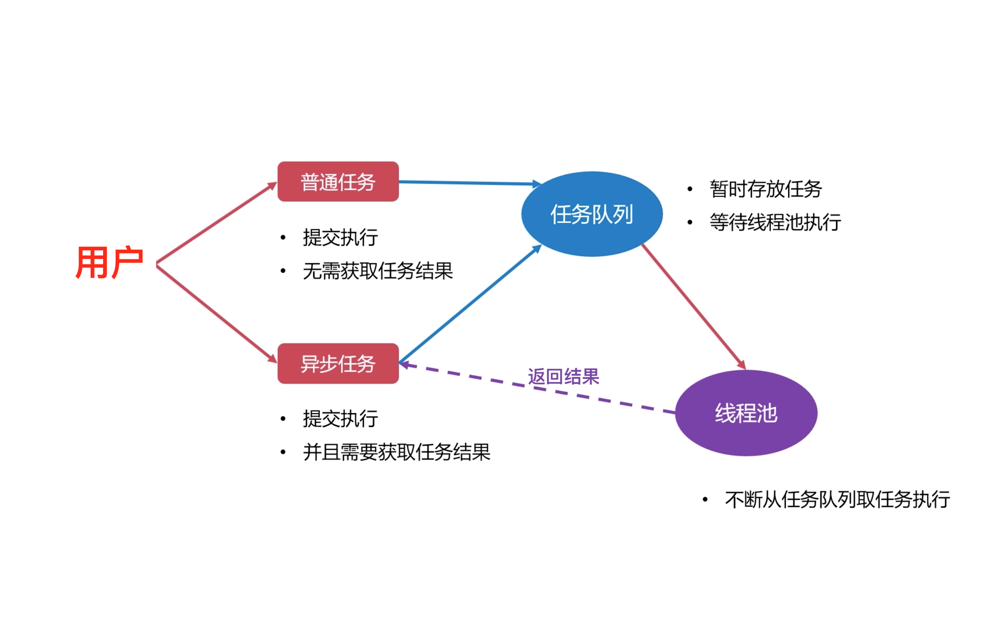

实现支持异步任务的线程池，包括线程同步、线程的使用等细节；了解线程池底层的技术！

* 队列用于存放多个元素（如线程、任务），是存放各种元素的池（线程池、任务池）；
* 队列提供的 API：需要获取当前元素的数量、向队列放入元素、 从队列取出元素；
* 队列可能有多个线程同时操作，因此需要保证线程安全；
 
需要考虑的线程安全的几种情况：
* 多个线程同时访问队列元素时：需要保证多个线程获取的串行；借助互斥锁来保护队列！
* 队列为空时，有线程来获取队列元素：阻塞线程、等待队列不为空；借助条件变量来等待队列元素；

# 1、线程同步

## 1.1、线程同步之互斥量

