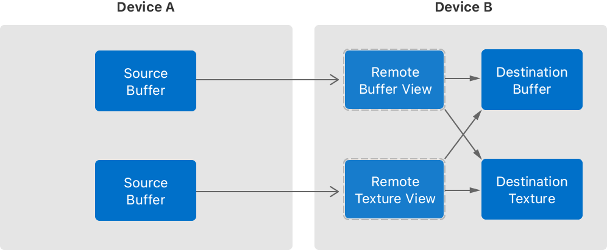

# MTLDevice

[MTLDevice](https://developer.apple.com/documentation/metal/mtldevice?language=objc) 用于绘制图形或进行并行计算的 GPU 接口！

# 获取设备

```
/** 获取系统推荐使用的 Metal device
 * 在 MacOS 系统会切换到高功率 GPU，支持自动图形切换；
 * 在其他支持多个GPU的系统上，它将与主显示相关联
 */
id <MTLDevice> __nullable MTLCreateSystemDefaultDevice(void);

/** 获取系统中的所有 Metal 设备
 * @discussion 这个 API 不会导致系统切换 GPU 设备，应用程序选择合适的标准来决定使用哪个GPU
 */
NSArray <id<MTLDevice>> *MTLCopyAllDevices(void);

/** 获取可用的 Metal 设备列表，并为列表的更改(增加，删除等)注册一个通知观察者
 * @param observer 接收设备通知的对象，观察者对象由 Metal 保留（retainCount +1 ）！
 *                 调用 MTLRemoveDeviceObserver() 函数，移除观察者
 * @param handler 当收到设备通知时调用的代码块
 */
NSArray <id<MTLDevice>> *MTLCopyAllDevicesWithObserver(id <NSObject> __nullable __strong * __nonnull observer, MTLDeviceNotificationHandler handler);

// 移除之前安装的设备更改通知观察者
void MTLRemoveDeviceObserver(id <NSObject> observer);

/** 根据指定标识符获取显示器
 * @note 当自动图形切换开启时，返回的设备可能随时改变
 */
id<MTLDevice> CGDirectDisplayCopyCurrentMetalDevice(CGDirectDisplayID display);
```


# 查询 GPU 属性


```
/** 在性能良好的情况下，该设备可以使用多少内存（单位是字节）
 * @note 如果设备过度使用，导致超过这个阈值，会出现性能损失；
 *       因此需要保持与此设备对象关联的所有资源小于这个阈值
 */
@property (readonly) uint64_t recommendedMaxWorkingSetSize;

/** 指示 GPU 是否与 CPU 共享其内存
 * @return YES 有些 GPU 没有专用的本地内存，需要与 CPU 共享CPU内存
 * @return NO 表示 GPU 有自己的专用内存，此时同步托管资源或将数据复制到与此GPU相关的私有资源可能需要额外的时间
 */
@property (readonly) BOOL hasUnifiedMemory;

/** 系统 RAM 和专用 GPU内存(VRAM)之间的最高理论传输速率，单位为字节/秒
 * @note 对于内置 GPU，这个值是 0
 * @discussion 这是由原始数据时钟速率导出的，因此在真实世界的条件下可能无法达到。
 */
@property (readonly) uint64_t maxTransferRate;

/// 厂商设备的全名
@property (nonnull, readonly) NSString *name;

/** 指示设备是否被配置为 headless, 仅在 MacOS 上可用
 * @return YES 在包含多个GPU的系统上，该设备不附加任何显示信息
 */
@property (readonly, getter=isHeadless) BOOL headless;

/** 是否是低功耗的 GPU 设备
 * @discussion 有些 Mac 包含多个 GPU，运行时具有不同的性能和能量特征，可以选择符合需求和当前 CPU 状态的 GPU
 *      如果 MacBook Pro 是靠电池供电运行，又对性能的要求不高，则选择低功耗的 GPU
 *      M1芯片只有一个GPU，运行时兼具高性能和低功耗，因此返回 NO
 *      通常情况下，对于集成GPU属性是 YES，对于离散GPU属性是 NO
 */
@property (readonly, getter=isLowPower) BOOL lowPower;

/** GPU 是否可移动 
 * 如果GPU在没有警告的情况下被移除，API 可能会在 MTLDeviceWasRemovedNotification 通知发布之前调用失败
 */
@property (readonly, getter=isRemovable) BOOL removable;

/** 设备的注册表 ID 值
 * 该值对所有任务都是全局的，可以用来跨任务边界标识 GPU
 * @discussion Metal 设备的 registryID 值对所有任务都是全局的，可以用来跨任务边界识别 GPU
 */
@property (readonly) uint64_t registryID;

/// 枚举值，指明 GPU 相对于主机的位置
@property (readonly) MTLDeviceLocation location;

/** GPU位置的更详细说明符：表示图形处理器绑定的槽位或 Thunderbolt 端口
 * 对于内置GPU，当GPU为低功耗(lowPower)时，该值为0，否则为 1
 * 多个 GPU 有可能有相同的位置和位置号，比如一个卡有多个 GPU，或者多个 eGPU 连接在同一个Thunderbolt端口
 */
@property (readonly) NSUInteger locationNumber;

/// 枚举 GPU 在 macOS 上的位置
typedef NS_ENUM(NSUInteger, MTLDeviceLocation) {
    MTLDeviceLocationBuiltIn = 0,   /// GPU内置在设备中
    MTLDeviceLocationSlot = 1,      /// GPU连接到计算机内部的一个插槽
    MTLDeviceLocationExternal = 2,  /// GPU通过外部接口连接，比如 Thunderbolt
    MTLDeviceLocationUnspecified = NSUIntegerMax, /// GPU位置未指定或无法确定
};
```

# 创建着色器库

工程中构建的所有 `.metal` 文件都会被编译到一个默认库中！

```
/// 获取 mainBundl 的默认库； 如果找不到默认库，返回nil
- (nullable id <MTLLibrary>)newDefaultLibrary;

/// 获取指定 NSBundle 的默认库
- (nullable id <MTLLibrary>)newDefaultLibraryWithBundle:(NSBundle *)bundle error:(__autoreleasing NSError **)error;

/// 获取指定路径的库（加载指定的 .metal 文件）
- (nullable id <MTLLibrary>)newLibraryWithFile:(NSString *)filepath error:(__autoreleasing NSError **)error;
- (nullable id <MTLLibrary>)newLibraryWithURL:(NSURL *)url error:(__autoreleasing NSError **)error;

/// 从 dispatch_data_t 中加载一个.metal 文件
- (nullable id <MTLLibrary>)newLibraryWithData:(dispatch_data_t)data error:(__autoreleasing NSError **)error;

/** 从编译指定源字符串中加载一个.metal 文件
 * @param source 包含一个或多个Metal函数源代码的字符串。
 * @param options 影响源代码编译的选项
 * @param completionHandler 当库加载完成时调用的代码块
 */
- (nullable id <MTLLibrary>)newLibraryWithSource:(NSString *)source options:(nullable MTLCompileOptions *)options error:(__autoreleasing NSError **)error;
- (void)newLibraryWithSource:(NSString *)source options:(nullable MTLCompileOptions *)options completionHandler:(MTLNewLibraryCompletionHandler)completionHandler;
```

# 创建缓冲区

创建一个 `MTLBuffer` 对象！

```
/// 缓冲区的最大字节数
@property (readonly) NSUInteger maxBufferLength;

/** 创建一个指定长度的缓冲区，以 0 填充该块内存
 * @param length 指定缓冲区的字节数
 * @param options 缓冲策略（CPU或GPU访问）
 */ 
- (nullable id <MTLBuffer>)newBufferWithLength:(NSUInteger)length options:(MTLResourceOptions)options;

/// 创建一个指定长度的缓冲区，将指定数据复制到该块内存
- (nullable id <MTLBuffer>)newBufferWithBytes:(const void *)pointer length:(NSUInteger)length options:(MTLResourceOptions)options;

/** 创建一个指定长度的缓冲区，持有指定数据的地址指针（而非复制该块内存）
 * @param 该缓冲区被释放时调用的代码块；如果不需要执行操作，则传递 nil；
 * @note1 地址指针指向的内存块必须是页对齐的；不同的硬件可能具有不同的页面大小，不应该假设总是4千字节；
 *        通常使用 vm_allocate 或 mmap 分配，不能使用 malloc 分配的内存； 
 * @note2 在释放 MTLBuffer 对象并调用 deallocator 之前，不能释放内存,只能在 deallocator 中释放该块内存；
 */
- (nullable id <MTLBuffer>)newBufferWithBytesNoCopy:(void *)pointer length:(NSUInteger)length options:(MTLResourceOptions)options deallocator:(void (^ __nullable)(void *pointer, NSUInteger length))deallocator;
```

# 创建渲染管道

`MTLRenderPipelineState` 是 Metal 提供的渲染管道 `API` ！ 

```
/// 同步创建并编译一个新的渲染管道
- (nullable id <MTLRenderPipelineState>)newRenderPipelineStateWithDescriptor:(MTLRenderPipelineDescriptor *)descriptor error:(__autoreleasing NSError **)error;

typedef void (^MTLNewRenderPipelineStateCompletionHandler)(id <MTLRenderPipelineState> __nullable renderPipelineState, NSError * __nullable error);

/// 异步创建并编译一个新的渲染管道
- (void)newRenderPipelineStateWithDescriptor:(MTLRenderPipelineDescriptor *)descriptor completionHandler:(MTLNewRenderPipelineStateCompletionHandler)completionHandler;

/// 当创建渲染管道的逻辑完成时调用的代码块: 返回渲染管道，反射信息，或者错误信息
typedef void (^MTLNewRenderPipelineStateWithReflectionCompletionHandler)(id <MTLRenderPipelineState> __nullable renderPipelineState, MTLRenderPipelineReflection * __nullable reflection, NSError * __nullable error);

/** 创建并编译一个新的渲染管道，并返回额外的 reflection 信息
 * @param reflection 指针指向的位置将被一个新对象填充，包含顶点函数、片段函数的反射数据、函数参数的详细信息。
 *                   如果管道状态不能被编译，则返回nil
 */ 
- (nullable id <MTLRenderPipelineState>)newRenderPipelineStateWithDescriptor:(MTLRenderPipelineDescriptor *)descriptor options:(MTLPipelineOption)options reflection:(MTLAutoreleasedRenderPipelineReflection * __nullable)reflection error:(__autoreleasing NSError **)error;
- (void)newRenderPipelineStateWithDescriptor:(MTLRenderPipelineDescriptor *)descriptor options:(MTLPipelineOption)options completionHandler:(MTLNewRenderPipelineStateWithReflectionCompletionHandler)completionHandler;

/** 为瓦片渲染器创建渲染管道，相关的反射信息
 * @param descriptor 包含瓦片函数的描述符对象
 * @param options 要返回的反射信息的类型
 */
- (void)newRenderPipelineStateWithTileDescriptor:(MTLTileRenderPipelineDescriptor *)descriptor options:(MTLPipelineOption)options completionHandler:(MTLNewRenderPipelineStateWithReflectionCompletionHandler)completionHandler;
- (nullable id <MTLRenderPipelineState>)newRenderPipelineStateWithTileDescriptor:(MTLTileRenderPipelineDescriptor*)descriptor options:(MTLPipelineOption)options reflection:(MTLAutoreleasedRenderPipelineReflection * __nullable)reflection error:(__autoreleasing NSError **)error;

```

## 

```
typedef NS_OPTIONS(NSUInteger, MTLPipelineOption) {
    MTLPipelineOptionNone               = 0,       /// 不需提供任何 reflection 信息
    
    /// 提供了MTLArgument的所有属性，除了bufferStructType和bufferPointerType为 nil
    /// 要获得这些详细的缓冲区类型属性，还必须设置 MTLPipelineOptionBufferTypeInfo 
    MTLPipelineOptionArgumentInfo       = 1 << 0,  /// 请求缓冲区、纹理和线程组内存的参数信息
    
    /// 提供了 MTLArgument 的bufferStructType和bufferPointerType属性
    /// 要获得这些详细的缓冲区类型属性，还必须设置 MTLPipelineOptionBufferTypeInfo 
    MTLPipelineOptionBufferTypeInfo     = 1 << 1,  /// 为缓冲区参数请求详细的缓冲区类型信息
    
    /// 只有当编译着色器存在于二进制存档中时，Metal 才应该创建 pipeline
    MTLPipelineOptionFailOnBinaryArchiveMiss = 1 << 2,
};
```


# 创建纹理

```
/// 创建一个纹理, 使用私有存储存储纹理数据, 已经为纹理图像数据分配了存储空间
- (nullable id <MTLTexture>)newTextureWithDescriptor:(MTLTextureDescriptor *)descriptor;

/** 创建一个纹理, 使用 IOSurface 存储纹理数据
 * @param iosurface 用于纹理存储的 IOSurface 引用
 * @param plane 在 IOSurface中使用的平面
 */
- (nullable id <MTLTexture>)newTextureWithDescriptor:(MTLTextureDescriptor *)descriptor iosurface:(IOSurfaceRef)iosurface plane:(NSUInteger)plane;


/** 创建一个可以跨进程共享的纹理
 * @discussion 可共享纹理必须使用私有存储模式 MTLResourceStorageModePrivate 创建
 *      通过创建一个纹理句柄 MTLSharedTextureHandle 并将其传递给其他进程，实现进程共享；
 *      但不能在不同的 GPU 之间共享
 */
- (nullable id <MTLTexture>)newSharedTextureWithDescriptor:(MTLTextureDescriptor *)descriptor;

/** 从接收到的纹理句柄 sharedHandle 重新创建共享的纹理
 * @param sharedHandle 进程空间共享纹理的句柄 (但仍然在相同的 GPU 范围内)
 * @note 这个方法应该在共享纹理最初创建的 MTLDevice 上调用。
 *       要确定它是哪个设备，可以使用 MTLSharedTextureHandle 对象的设备属性
 */
- (nullable id <MTLTexture>)newSharedTextureWithHandle:(MTLSharedTextureHandle *)sharedHandle;
```

# 创建命令队列

```
/// 创建一个新的命令队列 : 此方法创建的命令队列最多只允许 64 个未完成的命令缓冲区
- (nullable id <MTLCommandQueue>)newCommandQueue;

/// 设置命令队列的最大缓冲区数量
- (nullable id <MTLCommandQueue>)newCommandQueueWithMaxCommandBufferCount:(NSUInteger)maxCommandBufferCount;
```


# 创建计算管道

```
/// @param MTLComputePipelineDescriptor 创建计算管道的描述符
/// @param reflection 指定反射信息的类型
/// @param completionHandler 完成计算管道的创建时，调用的代码块
/// @param MTLFunction 要编译到计算管道的函数对象

/// 同步创建并编译计算管道
- (nullable id <MTLComputePipelineState>)newComputePipelineStateWithFunction:(id <MTLFunction>)computeFunction error:(__autoreleasing NSError **)error;
- (nullable id <MTLComputePipelineState>)newComputePipelineStateWithFunction:(id <MTLFunction>)computeFunction options:(MTLPipelineOption)options reflection:(MTLAutoreleasedComputePipelineReflection * __nullable)reflection error:(__autoreleasing NSError **)error;
- (nullable id <MTLComputePipelineState>)newComputePipelineStateWithDescriptor:(MTLComputePipelineDescriptor *)descriptor options:(MTLPipelineOption)options reflection:(MTLAutoreleasedComputePipelineReflection * __nullable)reflection error:(__autoreleasing NSError **)error;

/// 异步创建并编译计算管道
- (void)newComputePipelineStateWithFunction:(id <MTLFunction>)computeFunction completionHandler:(MTLNewComputePipelineStateCompletionHandler)completionHandler;
- (void)newComputePipelineStateWithFunction:(id <MTLFunction>)computeFunction options:(MTLPipelineOption)options completionHandler:(MTLNewComputePipelineStateWithReflectionCompletionHandler)completionHandler;
- (void)newComputePipelineStateWithDescriptor:(MTLComputePipelineDescriptor *)descriptor options:(MTLPipelineOption)options completionHandler:(MTLNewComputePipelineStateWithReflectionCompletionHandler)completionHandler;

typedef void (^MTLNewComputePipelineStateCompletionHandler)(id <MTLComputePipelineState> __nullable computePipelineState, NSError * __nullable error);
typedef void (^MTLNewComputePipelineStateWithReflectionCompletionHandler)(id <MTLComputePipelineState> __nullable computePipelineState, MTLComputePipelineReflection * __nullable reflection, NSError * __nullable error);
```


# 查找连接的 GPU 组

```
/** 同一对等体组的64位唯一标识符
 * 如果该值为0，表示该GPU不属于对等体组；否则属于对等体组
 * @discussion  一些 Mac 有多个GPU直接连接，允许数据从一个GPU传输到另一个GPU，而不需要先进入系统内存。
 *              使用这种方式连接GPU时，它们属于同一对等体组。 
 */
@property (readonly) uint64_t peerGroupID;

/// 对等体组中的设备总数
@property (readonly) uint32_t peerCount;

/// 所有属于同一对等体组的金属设备在组内都有一个从 0 到 peerCount - 1 的唯一索引值
@property (readonly) uint32_t peerIndex;
```

## 在连接的 GPU 组之间传输数据

在连接的 GPU 组之间使用高速连接，可以快速传输数据。

从 macOS 10.15 开始，一些Mac系统直接将图形处理器 GPU 相互连接，允许您在它们之间快速传输数据。
这些连接不仅速度更快，而且还避免了使用CPU和GPU之间的内存总线，让它可以用于其他任务。
如果你的应用程序使用多个GPU，测试它们是否连接，当它们连接时，使用这里描述的传输机制。

当GPU相互连接时，它们被称为在同一个对等组中。通过读取设备对象的 `peerGroupID` 来确定GPU是否在对等组中。非零值表示该GPU在对等体组中。

```
bool isMemberOfAnyPeerGroup(id<MTLDevice> device) {
    return (device.peerGroupID != 0);
}
```

同一对等体组中的GPU共享相同的 `peerGroupID`

```
bool areMembersOfSamePeerGroup(id<MTLDevice> deviceA, id<MTLDevice> deviceB) {
    return (isMemberOfAnyPeerGroup(deviceA) &&
            deviceA.peerGroupID == deviceB.peerGroupID);
}
```

通过对该ID进行过滤，可以获得与对等体组相关联的所有设备列表。

```
NSArray<id<MTLDevice>>* devicesInPeerGroup(uint64_t peerGroupID) {
    if (peerGroupID == 0) {
        return @[];
    }
    return [MTLCopyAllDevices() filteredArrayUsingPredicate:[NSPredicate predicateWithFormat:@"SELF.peerGroupID == %uul", peerGroupID]];
}
```

#### 将资源拷贝到需要访问资源的GPU上

在Metal中，资源是由设备对象创建的，并且总是与创建它们的设备对象相关联。
对等体组不会改变这种联系。如果一个资源与一个设备对象相关联，而你想在另一个设备对象上访问它，你需要将数据复制到与第二个设备对象相关联的资源中。

要在一个对等组的成员之间复制数据，在连接到你想要复制的资源的第二个GPU上创建一个`remote view`。
`remote view` 是一个资源对象，它不包含自己的存储;它引用了原始GPU上的存储。
您只能使用`remote view`来复制数据;在其他Metal命令中使用它们会导致错误。

#### 创建资源的 `RemoteBufferView`

要创建资源的 `RemoteBufferView`，创建资源视图的设备对象必须与创建资源的设备对象共享相同的peerGroupID。
另外，该资源必须使用 `MTLStorageModePrivate` 存储模式，或者需要 `IOSurface` 支持。

要创建一个缓冲区视图，调用 `-newRemoteBufferViewForDevice:` 方法 :

```
id<MTLBuffer> remoteBufferView = [sourceBuffer newRemoteBufferViewForDevice:otherDevice];
```

类似地，要创建一个纹理视图，调用 `-newRemoteTextureViewForDevice:` 方法

```
id<MTLTexture> remoteTextureView = [sourceTexture newRemoteTextureViewForDevice:otherDevice];
```


#### 在已连接的 GPU 之间复制数据

创建一个 `MTLBlitCommandEncoder` 并编码一个复制命令。这个复制命令的源是远程视图对象:


```
id<MTLBlitCommandEncoder> blitEncoder = [commandBuffer blitCommandEncoder];
[blitEncoder copyFromBuffer:remoteBufferView sourceOffset:0
                   toBuffer:destinationBuffer destinationOffset:0
                       size:remoteBufferView.allocatedSize];
[blitEncoder copyFromTexture:remoteTextureView
                   toTexture:destinationTexture];
[blitEncoder endEncoding];
```

如下图所示，有三个资源对象:包含数据的原始资源、引用数据的远程视图和接收数据的资源。




#### 同步资源访问

点对点传输中使用的Blit命令遵循所有GPU上的同步规则。然而，它们不会自动与源GPU上运行的任何命令同步。
如果编码了修改源资源的命令，在执行blit命令将数据传输到其他GPU之前，请确保这些命令已经完成。
这与通过系统内存在GPU之间传输资源时所做的相同。

要在不同设备对象之间同步命令，需要使用共享事件！

# 查询特征集和 GPU 系列

```
/*!
 @method supportsFamily:
 @abstract Returns TRUE if the GPU Family is supported by this MTLDevice.
 */
- (BOOL)supportsFamily:(MTLGPUFamily)gpuFamily API_AVAILABLE(macos(10.15), ios(13.0));

/*!
 @method supportsFeatureSet:
 @abstract Returns TRUE if the feature set is supported by this MTLDevice.
 */
- (BOOL)supportsFeatureSet:(MTLFeatureSet)featureSet;

typedef NS_ENUM(NSInteger, MTLGPUFamily)
{
    MTLGPUFamilyApple1 = 1001,
    MTLGPUFamilyApple2 = 1002,
    MTLGPUFamilyApple3 = 1003,
    MTLGPUFamilyApple4 = 1004,
    MTLGPUFamilyApple5 = 1005,
    MTLGPUFamilyApple6 = 1006,
    MTLGPUFamilyApple7 = 1007,
    
    MTLGPUFamilyMac1 = 2001,
    MTLGPUFamilyMac2 = 2002,
    
    MTLGPUFamilyCommon1 = 3001,
    MTLGPUFamilyCommon2 = 3002,
    MTLGPUFamilyCommon3 = 3003,
    
    MTLGPUFamilyMacCatalyst1 = 4001,
    MTLGPUFamilyMacCatalyst2 = 4002,
} API_AVAILABLE(macos(10.15), ios(13.0));

typedef NS_ENUM(NSUInteger, MTLFeatureSet)
{
    MTLFeatureSet_iOS_GPUFamily1_v1 API_AVAILABLE(ios(8.0)) API_UNAVAILABLE(macos, macCatalyst, tvos) = 0,
    MTLFeatureSet_iOS_GPUFamily2_v1 API_AVAILABLE(ios(8.0)) API_UNAVAILABLE(macos, macCatalyst, tvos) = 1,

    MTLFeatureSet_iOS_GPUFamily1_v2 API_AVAILABLE(ios(9.0)) API_UNAVAILABLE(macos, macCatalyst, tvos) = 2,
    MTLFeatureSet_iOS_GPUFamily2_v2 API_AVAILABLE(ios(9.0)) API_UNAVAILABLE(macos, macCatalyst, tvos) = 3,
    MTLFeatureSet_iOS_GPUFamily3_v1 API_AVAILABLE(ios(9.0)) API_UNAVAILABLE(macos, macCatalyst, tvos) = 4,

    MTLFeatureSet_iOS_GPUFamily1_v3 API_AVAILABLE(ios(10.0)) API_UNAVAILABLE(macos, macCatalyst, tvos) = 5,
    MTLFeatureSet_iOS_GPUFamily2_v3 API_AVAILABLE(ios(10.0)) API_UNAVAILABLE(macos, macCatalyst, tvos) = 6,
    MTLFeatureSet_iOS_GPUFamily3_v2 API_AVAILABLE(ios(10.0)) API_UNAVAILABLE(macos, macCatalyst, tvos) = 7,

    MTLFeatureSet_iOS_GPUFamily1_v4 API_AVAILABLE(ios(11.0)) API_UNAVAILABLE(macos, macCatalyst, tvos) = 8,
    MTLFeatureSet_iOS_GPUFamily2_v4 API_AVAILABLE(ios(11.0)) API_UNAVAILABLE(macos, macCatalyst, tvos) = 9,
    MTLFeatureSet_iOS_GPUFamily3_v3 API_AVAILABLE(ios(11.0)) API_UNAVAILABLE(macos, macCatalyst, tvos) = 10,
    MTLFeatureSet_iOS_GPUFamily4_v1 API_AVAILABLE(ios(11.0)) API_UNAVAILABLE(macos, macCatalyst, tvos) = 11,
    
    MTLFeatureSet_iOS_GPUFamily1_v5 API_AVAILABLE(ios(12.0)) API_UNAVAILABLE(macos, macCatalyst, tvos) = 12,
    MTLFeatureSet_iOS_GPUFamily2_v5 API_AVAILABLE(ios(12.0)) API_UNAVAILABLE(macos, macCatalyst, tvos) = 13,
    MTLFeatureSet_iOS_GPUFamily3_v4 API_AVAILABLE(ios(12.0)) API_UNAVAILABLE(macos, macCatalyst, tvos) = 14,
    MTLFeatureSet_iOS_GPUFamily4_v2 API_AVAILABLE(ios(12.0)) API_UNAVAILABLE(macos, macCatalyst, tvos) = 15,
    MTLFeatureSet_iOS_GPUFamily5_v1 API_AVAILABLE(ios(12.0)) API_UNAVAILABLE(macos, macCatalyst, tvos) = 16,

    MTLFeatureSet_macOS_GPUFamily1_v1 API_AVAILABLE(macos(10.11)) API_UNAVAILABLE(ios) API_UNAVAILABLE(macCatalyst) = 10000,
    MTLFeatureSet_OSX_GPUFamily1_v1 API_AVAILABLE(macos(10.11)) API_UNAVAILABLE(ios) = MTLFeatureSet_macOS_GPUFamily1_v1, // deprecated

    MTLFeatureSet_macOS_GPUFamily1_v2 API_AVAILABLE(macos(10.12)) API_UNAVAILABLE(ios) API_UNAVAILABLE(macCatalyst) = 10001,
    MTLFeatureSet_OSX_GPUFamily1_v2 API_AVAILABLE(macos(10.12)) API_UNAVAILABLE(ios) = MTLFeatureSet_macOS_GPUFamily1_v2, // deprecated
    MTLFeatureSet_macOS_ReadWriteTextureTier2 API_AVAILABLE(macos(10.12)) API_UNAVAILABLE(ios) = 10002,
    MTLFeatureSet_OSX_ReadWriteTextureTier2 API_AVAILABLE(macos(10.12)) API_UNAVAILABLE(ios) = MTLFeatureSet_macOS_ReadWriteTextureTier2, // deprecated

    MTLFeatureSet_macOS_GPUFamily1_v3 API_AVAILABLE(macos(10.13)) API_UNAVAILABLE(ios) API_UNAVAILABLE(macCatalyst) = 10003,
    
    MTLFeatureSet_macOS_GPUFamily1_v4 API_AVAILABLE(macos(10.14)) API_UNAVAILABLE(ios) API_UNAVAILABLE(macCatalyst) = 10004,
    MTLFeatureSet_macOS_GPUFamily2_v1 API_AVAILABLE(macos(10.14)) API_UNAVAILABLE(ios) API_UNAVAILABLE(macCatalyst) = 10005,


    MTLFeatureSet_tvOS_GPUFamily1_v1 API_AVAILABLE(tvos(9.0)) API_UNAVAILABLE(macos, ios) = 30000,
    MTLFeatureSet_TVOS_GPUFamily1_v1 API_AVAILABLE(tvos(9.0)) API_UNAVAILABLE(macos, ios) = MTLFeatureSet_tvOS_GPUFamily1_v1, // deprecated
    
    MTLFeatureSet_tvOS_GPUFamily1_v2 API_AVAILABLE(tvos(10.0)) API_UNAVAILABLE(macos, ios) = 30001,
    
    MTLFeatureSet_tvOS_GPUFamily1_v3 API_AVAILABLE(tvos(11.0)) API_UNAVAILABLE(macos, ios) = 30002,
    MTLFeatureSet_tvOS_GPUFamily2_v1 API_AVAILABLE(tvos(11.0)) API_UNAVAILABLE(macos, ios) = 30003,
    
    MTLFeatureSet_tvOS_GPUFamily1_v4 API_AVAILABLE(tvos(12.0)) API_UNAVAILABLE(macos, ios) = 30004,
    MTLFeatureSet_tvOS_GPUFamily2_v2 API_AVAILABLE(tvos(12.0)) API_UNAVAILABLE(macos, ios) = 30005,
} API_AVAILABLE(macos(10.11), ios(8.0), tvos(9.0));
```

# 查询参数缓冲区支持

```
/*!
 @property argumentBuffersSupport
 @abstract Query support tier for Argument Buffers.
 @return MTLArgumentBuffersTier enum value.
 */
@property (readonly) MTLArgumentBuffersTier argumentBuffersSupport API_AVAILABLE(macos(10.13), ios(11.0));

/*!
 @property maxArgumentBufferSamplerCount
 @abstract The maximum number of unique argument buffer samplers per app.
 @discussion This limit is only applicable to samplers that have their supportArgumentBuffers property set to true. A MTLSamplerState object is considered unique if the configuration of its originating MTLSamplerDescriptor properties is unique. For example, two samplers with equal minFilter values but different magFilter values are considered unique.
 */
@property (readonly) NSUInteger maxArgumentBufferSamplerCount API_AVAILABLE(macos(10.14), ios(12.0));
```


# 查询计数器采样支持

```
/*!
 @property counterSets
 @abstract Returns the set of Counter Sets exposed by the device.
 */
@property (readonly, nullable) NSArray<id<MTLCounterSet>>* counterSets API_AVAILABLE(macos(10.15), ios(14.0));

/*!
 @method supportsCounterSampling:
 @abstract Query device for counter sampling points support.
 @param samplingPoint Query index
 @return BOOL value. If YES, the device supports counter sampling at given point.
*/
- (BOOL)supportsCounterSampling:(MTLCounterSamplingPoint)samplingPoint API_AVAILABLE(macos(11.0), ios(14.0));

/*!
 @enum MTLCounterSamplingPoint
 @abstract MTLCounterSamplingPoint determines type of sampling points that are supported on given device.

 @constant MTLCounterSamplingPointAtStageBoundary
 Counter sampling points at render, compute, and blit command encoder stage boundary are supported.

 @constant MTLCounterSamplingPointAtDrawBoundary
 Counter sampling at draw boundary is supported, render encoder method sampleCountersInBuffer can be used for sampling.

 @constant MTLCounterSamplingPointAtDispatchBoundary
 Counter sampling at compute dispatch boundary is supported, compute encoder method sampleCountersInBuffer can be used for sampling.

 @constant MTLCounterSamplingPointAtTileDispatchBoundary
 Counter sampling at tile shader dispatch boundary is supported.

 @constant MTLCounterSamplingPointAtBlitBoundary
 Counter sampling at blit boundary is supported, blit encoder method sampleCountersInBuffer can be used for sampling.
*/
typedef NS_ENUM(NSUInteger, MTLCounterSamplingPoint)
{
    MTLCounterSamplingPointAtStageBoundary,
    MTLCounterSamplingPointAtDrawBoundary,
    MTLCounterSamplingPointAtDispatchBoundary,
    MTLCounterSamplingPointAtTileDispatchBoundary,
    MTLCounterSamplingPointAtBlitBoundary
} API_AVAILABLE(macos(11.0), ios(14.0));
```


# 查询动态库和函数支持

```
/*!
 @property supportsDynamicLibraries
 @abstract Query device support for compiling dynamic libraries.
 @return BOOL value. If YES, the device supports compiling dynamic libraries. If NO, the devices does not.
 */
@property(readonly) BOOL supportsDynamicLibraries API_AVAILABLE(macos(11.0), ios(14.0));

@property (readonly) BOOL supportsFunctionPointers API_AVAILABLE(macos(11.0), ios(14.0));

@property(readonly) BOOL supportsFunctionPointersFromRender;
```

# 查询光线追踪支持

```
@property (readonly) BOOL supportsRaytracing API_AVAILABLE(macos(11.0), ios(14.0));

@property(readonly) BOOL supportsRaytracingFromRender;
```


# 查询渲染特性支持

```
/*!
 @property barycentricsSupported
 @abstract Query device for Barycentric coordinates support; deprecated, use supportsShaderBarycentricCoordinates
 @return BOOL value. If YES, the device barycentric coordinates
 */
@property(readonly, getter=areBarycentricCoordsSupported) BOOL barycentricCoordsSupported API_AVAILABLE(macos(10.15)) API_UNAVAILABLE(ios);

/*!
 @property programmableSaplePositionsSupported
 @abstract Query device for programmable sample position support.
 @return BOOL value. If YES, the device supports programmable sample positions. If NO, the device does not.
 */
@property (readonly, getter=areProgrammableSamplePositionsSupported) BOOL programmableSamplePositionsSupported API_AVAILABLE(macos(10.13), ios(11.0));


/*!
 @method getDefaultSamplePositions:count:
 @abstract Retrieve the default sample positions.
 @param positions The destination array for default sample position data.
 @param count Specifies the sample count for which to retrieve the default positions, the length of the positions array, and must be set to a valid sample count.
 */
- (void)getDefaultSamplePositions:(MTLSamplePosition *)positions count:(NSUInteger)count API_AVAILABLE(macos(10.13), ios(11.0));

/*!
 @property rasterOrderGroupsSupported
 @abstract Query device for raster order groups support.
 @return BOOL value. If YES, the device supports raster order groups. If NO, the device does not.
 */
@property (readonly, getter=areRasterOrderGroupsSupported) BOOL rasterOrderGroupsSupported API_AVAILABLE(macos(10.13), ios(11.0));

/*!
 @property supports32BitMSAA
 @abstract Query device for 32-bit MSAA texture support. Specifically, added support for allocating 32-bit Integer format textures (R32Uint, R32Sint, RG32Uint, RG32Sint, RGBA32Uint, and RGBA32Sint) and resolving 32-bit Float format textures (R32Float, RG32Float, and RGBA32Float).
 @return BOOL value. If YES, the device supports these additional 32-bit MSAA texture capabilities. If NO, the devices does not.
 */
@property(readonly) BOOL supports32BitMSAA API_AVAILABLE(macos(11.0), ios(14.0));


/*!
 @property supportsPullModelInterpolation
 @abstract Query device for pull model interpolation support which allows a fragment shader to compute multiple interpolations (at center, at centroid, at offset, at sample) of a fragment input.
 @return BOOL value. If YES, the device supports pull model interpolation. If NO, the device does not.
 */
@property(readonly) BOOL supportsPullModelInterpolation API_AVAILABLE(macos(11.0),ios(14.0));

/*!
 @property supportsShaderBarycentricCoordinates
 @abstract Query device for Barycentric Coordinates support.
 @return BOOL value. If YES, the device supports barycentric coordinates. If NO, the device does not.
 */
 @property (readonly) BOOL supportsShaderBarycentricCoordinates API_AVAILABLE(macos(10.15)) API_UNAVAILABLE(ios);

/*!
 @property supportsVertexAmplificationCount:
 @abstract Query device for vertex amplification support.
 @param count The amplification count to check
 @return BOOL value. If YES, the device supports vertex amplification with the given count. If NO, the device does not.
 */
- (BOOL)supportsVertexAmplificationCount:(NSUInteger)count API_AVAILABLE(macos(10.15.4), ios(13.0), macCatalyst(13.4));
```

# 查询纹理和采样器支持


```
/*!
 @property depth24Stencil8PixelFormatSupported
 @abstract If YES, device supports MTLPixelFormatDepth24Unorm_Stencil8.
 */
@property (readonly, getter=isDepth24Stencil8PixelFormatSupported) BOOL depth24Stencil8PixelFormatSupported API_AVAILABLE(macos(10.11), macCatalyst(13.0)) API_UNAVAILABLE(ios);

/*!
 @property supports32BitFloatFiltering
 @abstract Query device for 32-bit Float texture filtering support. Specifically, R32Float, RG32Float, and RGBA32Float.
 @return BOOL value. If YES, the device supports filtering 32-bit Float textures. If NO, the device does not.
 */
@property(readonly) BOOL supports32BitFloatFiltering API_AVAILABLE(macos(11.0), ios(14.0));

/*!
 @property supportsBCTextureCompression
 @abstract Query device for BC Texture format support
 @return BOOL value. If YES, the device supports compressed BC Texture formats. If NO, the device does not.
 */
 @property (readonly) BOOL supportsBCTextureCompression API_AVAILABLE(macos(11.0), ios(14.0));

/*!
@property supportsQueryTextureLOD
@abstract Query device for whether it supports the `calculate_clampled_lod` and `calculate_unclamped_lod` Metal shading language functionality.
@return BOOL value. If YES, the device supports the calculate LOD functionality. If NO, the device does not.
*/
@property (readonly) BOOL supportsQueryTextureLOD API_AVAILABLE(macos(11.0), ios(14.0));

/*!
 @method supportsTextureSampleCount:
 @brief Query device if it support textures with a given sampleCount.
 @return BOOL value. If YES, device supports the given sampleCount for textures. If NO, device does not support the given sampleCount.
 */
- (BOOL)supportsTextureSampleCount:(NSUInteger)sampleCount API_AVAILABLE(macos(10.11), ios(9.0));

/*!
 @property readWriteTextureSupport
 @abstract Query support tier for read-write texture formats.
 @return MTLReadWriteTextureTier enum value.
 */
@property (readonly) MTLReadWriteTextureTier readWriteTextureSupport API_AVAILABLE(macos(10.13), ios(11.0));

/*!
 @method minimumLinearTextureAlignmentForPixelFormat:
 @abstract Returns the minimum alignment required for offset and rowBytes when creating a linear texture. An error is thrown for queries with invalid pixel formats (depth, stencil, or compressed formats).
 */
- (NSUInteger)minimumLinearTextureAlignmentForPixelFormat:(MTLPixelFormat)format API_AVAILABLE(macos(10.13), ios(11.0));

/*!
 @method minimumTextureBufferAlignmentForPixelFormat:
 @abstract Returns the minimum alignment required for offset and rowBytes when creating a texture buffer from a buffer.
 */
- (NSUInteger)minimumTextureBufferAlignmentForPixelFormat:(MTLPixelFormat)format API_AVAILABLE(macos(10.14), ios(12.0));
```

# 确定线程组限制

```
/*!
 @property maxThreadgroupMemoryLength
 @abstract The maximum threadgroup memory available, in bytes.
 */
@property (readonly) NSUInteger maxThreadgroupMemoryLength API_AVAILABLE(macos(10.13), ios(11.0));

/*!
 @property maxThreadsPerThreadgroup
 @abstract The maximum number of threads along each dimension.
 */
@property (readonly) MTLSize maxThreadsPerThreadgroup API_AVAILABLE(macos(10.11), ios(9.0));
```

# 为光线追踪创建加速结构


```
- (MTLAccelerationStructureSizes)accelerationStructureSizesWithDescriptor:(MTLAccelerationStructureDescriptor *)descriptor API_AVAILABLE(macos(11.0), ios(14.0));

- (nullable id <MTLAccelerationStructure>)newAccelerationStructureWithSize:(NSUInteger)size API_AVAILABLE(macos(11.0), ios(14.0));
- (nullable id <MTLAccelerationStructure>)newAccelerationStructureWithDescriptor:(MTLAccelerationStructureDescriptor *)descriptor API_AVAILABLE(macos(11.0), ios(14.0));


/**
 * @brief Describes the memory requirements for an acceleration structure
 */
typedef struct {
    /**
     * @brief The required size, in bytes, of the built acceleration structure
     */
    NSUInteger accelerationStructureSize;
    
    /**
     * @brief The required size, in bytes, of the scratch buffer used to build the acceleration structure
     */
    NSUInteger buildScratchBufferSize;
    
    /**
     * @brief The required size, in bytes, of the scratch buffer used to refit the acceleration structure
     */
    NSUInteger refitScratchBufferSize;
} MTLAccelerationStructureSizes;
```

# 创建参数缓冲区编码器

```
/*!
 * @method newArgumentEncoderWithArguments:count:
 * @abstract Creates an argument encoder for an array of argument descriptors which will be encoded sequentially.
 */
- (nullable id <MTLArgumentEncoder>)newArgumentEncoderWithArguments:(NSArray <MTLArgumentDescriptor *> *)arguments;
```


# 创建二进制着色器档案

```
/*!
 @method newBinaryArchiveWithDescriptor:error:
 @abstract Creates a MTLBinaryArchive using the configuration in the descriptor.
 @see MTLBinaryArchive
 @param descriptor The descriptor for the configuration of the binary archive to create.
 @param error If an error occurs during creation, this parameter is updated to describe the failure.
 @return On success, the created MTLBinaryArchive. On failure, nil.
 */
- (nullable id<MTLBinaryArchive>) newBinaryArchiveWithDescriptor:(MTLBinaryArchiveDescriptor*)descriptor
                                                           error:(NSError**)error API_AVAILABLE(macos(11.0), ios(14.0));
```


# 创建计数器样本缓冲区


```
/*!
 @method newCounterSampleBufferWithDescriptor:error:
 @abstract Given a counter sample buffer descriptor, allocate a new counter
 sample buffer.
 This may return nil if the counters may not all be collected simultaneously.
 @param descriptor The descriptor to create a sample buffer for
 @param error An error return on failure.
 */
- (nullable id<MTLCounterSampleBuffer>) newCounterSampleBufferWithDescriptor:(MTLCounterSampleBufferDescriptor*)descriptor
                                                              error:(NSError**)error
    API_AVAILABLE(macos(10.15), ios(14.0));
```

# 创建深度和模板测试对象

当片段着色器处理完片段之后，模板测试(stencil test) 就开始执行了，和深度测试一样，它能丢弃一些片段；仍然保留下来的片段进入深度测试阶段，深度测试可能丢弃更多。

模板测试基于另一个缓冲，这个缓冲叫做模板缓冲(stencil buffer)，我们被允许在渲染时更新它来获取有意思的效果。
模板缓冲中的模板值（stencil value）通常是8位的，因此每个片段（像素）共有256种不同的模板值。这样我们就能将这些模板值设置为我们链接的，然后在模板测试时根据这个模板值，我们就可以决定丢弃或保留它了。


```
/// 创建包含深度测试和模板测试的对象
- (nullable id <MTLDepthStencilState>)newDepthStencilStateWithDescriptor:(MTLDepthStencilDescriptor *)descriptor;
```


# 创建动态着色器库


```
/*!
 @method newDynamicLibrary:error:
 @abstract Creates a MTLDynamicLibrary by compiling the code in a MTLLibrary.
 @see MTLDynamicLibrary
 @param library The MTLLibrary from which to compile code. This library must have .type set to MTLLibraryTypeDynamic.
 @param error If an error occurs during creation, this parameter is updated to describe the failure.
 @return On success, the MTLDynamicLibrary containing compiled code. On failure, nil.
 */
- (nullable id<MTLDynamicLibrary>) newDynamicLibrary:(id<MTLLibrary>)library error:(NSError **) error API_AVAILABLE(macos(11.0), ios(14.0));

/*!
 @method newDynamicLibraryWithURL:error:
 @abstract Creates a MTLDynamicLibrary by loading compiled code from a file.
 @see MTLDynamicLibrary
 @param url The file URL from which to load. If the file contains no compiled code for this device, compilation is attempted as with newDynamicLibrary:error:
 @param error If an error occurs during creation, this parameter is updated to describe the failure.
 @return On success, the MTLDynamicLibrary containing compiled code (either loaded or compiled). On failure, nil.
 */
- (nullable id<MTLDynamicLibrary>) newDynamicLibraryWithURL:(NSURL *)url error:(NSError **) error API_AVAILABLE(macos(11.0), ios(14.0));

```


# 创建事件


```
/*!
 @method newEvent
 @abstract Returns a new single-device non-shareable Metal event object
*/
- (nullable id <MTLEvent>)newEvent API_AVAILABLE(macos(10.14), ios(12.0));

/*!
 @method newSharedEvent
 @abstract Returns a shareable multi-device event.
 */
- (nullable id <MTLSharedEvent>)newSharedEvent API_AVAILABLE(macos(10.14), ios(12.0));

/*!
 @method newSharedEventWithHandle
 @abstract Creates a shareable multi-device event from an existing shared event handle.
*/
- (nullable id <MTLSharedEvent>)newSharedEventWithHandle:(MTLSharedEventHandle *)sharedEventHandle API_AVAILABLE(macos(10.14), ios(12.0));
```

# 创建栅栏

`MTLFence` 对象用于跨命令编码器跟踪和管理子分配的资源依赖性。资源依赖性随着资源由不同命令生成和使用而出现，无论这些命令是编码到同一队列还是不同队列。
`MTLFence` 捕获GPU工作到特定时间点；当GPU遇到`MTLFence`时，它必须等到所有捕获的工作完成后再继续执行。

```
/// 创建栅栏: 主要用于跟踪目的，仅支持GPU内部跟踪，而不支持CPU和GPU之间的跟踪
/// MTLFence 可以重复更新，硬件管理 MTLFence 更新以防止死锁
- (nullable id <MTLFence>)newFence;
```

# 创建间接命令缓冲区

```
/*!
 * @method newIndirectCommandBufferWithDescriptor:maxCommandCount:options
 * @abstract Creates a new indirect command buffer with the given descriptor and count.
 * @param descriptor The descriptor encodes the maximum logical stride of each command.
 * @param maxCount The maximum number of commands that this buffer can contain.
 * @param options The options for the indirect command buffer.
 * @discussion The returned buffer can be safely executed without first encoding into (but is wasteful).
 */
- (nullable id <MTLIndirectCommandBuffer>)newIndirectCommandBufferWithDescriptor:(MTLIndirectCommandBufferDescriptor*)descriptor maxCommandCount:(NSUInteger)maxCount options:(MTLResourceOptions)options;
```

# 创建光栅化率图

```
/*!
 @method supportsRasterizationRateMapWithLayerCount:
 @abstract Query device for variable rasterization rate support with the given number of layers.
 @param layerCount The number of layers for which to query device support.
 @return YES if the device supports creation of rendering using a MTLRasterizationRateMap with the given number of layers.
 */
-(BOOL)supportsRasterizationRateMapWithLayerCount:(NSUInteger)layerCount API_AVAILABLE(macos(10.15.4), ios(13.0), macCatalyst(13.4));

/*!
 @method newRasterizationRateMapWithDescriptor:
 @abstract Creates a new variable rasterization rate map with the given descriptor.
 @discussion If '[self supportsRasterizationRateMapWithLayerCount:descriptor.layerCount]' returns NO, or descriptor.screenSize describes an empty region, the result will always be nil.
 @return A MTLRasterizationRateMap instance that can be used for rendering on this MTLDevice, or nil if the device does not support the combination of parameters stored in the descriptor.
 */
-(nullable id<MTLRasterizationRateMap>)newRasterizationRateMapWithDescriptor:(MTLRasterizationRateMapDescriptor*)descriptor API_AVAILABLE(macos(10.15.4), ios(13.0), macCatalyst(13.4));
```

# 创建资源堆

```
/*!
 @method heapTextureSizeAndAlignWithDescriptor:
 @abstract Determine the byte size of textures when sub-allocated from a heap.
 @discussion This method can be used to help determine the required heap size.
 */
- (MTLSizeAndAlign)heapTextureSizeAndAlignWithDescriptor:(MTLTextureDescriptor *)desc API_AVAILABLE(macos(10.13), ios(10.0));

/*!
 @method heapBufferSizeAndAlignWithLength:options:
 @abstract Determine the byte size of buffers when sub-allocated from a heap.
 @discussion This method can be used to help determine the required heap size.
 */
- (MTLSizeAndAlign)heapBufferSizeAndAlignWithLength:(NSUInteger)length options:(MTLResourceOptions)options API_AVAILABLE(macos(10.13), ios(10.0));

/*!
 @method newHeapWithDescriptor:
 @abstract Create a new heap with the given descriptor.
 */
- (nullable id <MTLHeap>)newHeapWithDescriptor:(MTLHeapDescriptor *)descriptor API_AVAILABLE(macos(10.13), ios(10.0));
```

# 创建采样器


```

/*!
 @method newSamplerStateWithDescriptor:
 @abstract Create a new sampler.
*/
- (nullable id <MTLSamplerState>)newSamplerStateWithDescriptor:(MTLSamplerDescriptor *)descriptor;
```


# 管理 GPU 内存

```
/*!
 @property currentAllocatedSize
 @abstract The current size in bytes of all resources allocated by this device
 */
@property (readonly) NSUInteger currentAllocatedSize API_AVAILABLE(macos(10.13), ios(11.0));
```

# 读取时间戳

```
#if defined(MTL_TIMESTAMP_AS_NSUINTEGER) && MTL_TIMESTAMP_AS_NSUINTEGER
typedef NSUInteger MTLTimestamp;
#else
typedef uint64_t MTLTimestamp;
#endif
/*!
 @method sampleTimestamps:gpuTimestamp:
 @abstract Sample the CPU and GPU timestamps as closely as possible.
 @param cpuTimestamp The timestamp on the CPU
 @param gpuTimestamp The timestamp on the GPU
 */
-(void)sampleTimestamps:(MTLTimestamp *)cpuTimestamp
           gpuTimestamp:(MTLTimestamp *)gpuTimestamp
    API_AVAILABLE(macos(10.15), ios(14.0));
```

# 使用稀疏纹理平铺


```

//Keep around to keep building

/*!
 * @method sparseTileSizeWithTextureType:pixelFormat:sampleCount:
 * @abstract Returns tile size for sparse texture with given type, pixel format and sample count.
 */
-(MTLSize) sparseTileSizeWithTextureType:(MTLTextureType)textureType
                             pixelFormat:(MTLPixelFormat)pixelFormat
                             sampleCount:(NSUInteger)sampleCount API_AVAILABLE(macos(11.0), macCatalyst(14.0), ios(13.0));

/*!
 @property sparseTileSizeInBytes
 @abstract Returns the number of bytes required to map one sparse texture tile.
 */
@property (readonly) NSUInteger sparseTileSizeInBytes API_AVAILABLE(macos(11.0), macCatalyst(14.0), ios(13.0));

@optional
/*!
 * @method convertSparsePixelRegions:toTileRegions:withTileSize:alignmentMode:numRegions:
 * @abstract Converts regions in pixels to regions in sparse tiles using specified alignment mode.
   Tile size can be obtained from tileSizeWithTextureType:pixelFormat:sampleCount: method.
 */
-(void) convertSparsePixelRegions:(const MTLRegion[_Nonnull])pixelRegions
                    toTileRegions:(MTLRegion[_Nonnull])tileRegions
                     withTileSize:(MTLSize)tileSize
                    alignmentMode:(MTLSparseTextureRegionAlignmentMode)mode
                       numRegions:(NSUInteger)numRegions API_AVAILABLE(macos(11.0), macCatalyst(14.0), ios(13.0));

/*!
 * @method convertSparseTileRegions:toPixelRegions:withTileSize:numRegions:
 * @abstract Convertes region in sparse tiles to region in pixels
   Tile size can be obtained from tileSizeWithTextureType:pixelFormat:sampleCount: method.
 */
-(void) convertSparseTileRegions:(const MTLRegion[_Nonnull])tileRegions
                  toPixelRegions:(MTLRegion[_Nonnull])pixelRegions
                    withTileSize:(MTLSize)tileSize
                      numRegions:(NSUInteger)numRegions API_AVAILABLE(macos(11.0), macCatalyst(14.0), ios(13.0));
                      

/*!
 @enum MTLSparseTextureRegionAlignmentMode
 @abstract MTLSparseTextureRegionAlignmentMode determines type of alignment used when converting from pixel region to tile region.
 */
typedef NS_ENUM(NSUInteger, MTLSparseTextureRegionAlignmentMode)
{
    MTLSparseTextureRegionAlignmentModeOutward   = 0,
    MTLSparseTextureRegionAlignmentModeInward    = 1,
} API_AVAILABLE(macos(11.0), macCatalyst(14.0), ios(13.0));
```

# 实例属性

```
@property(readonly) BOOL supportsPrimitiveMotionBlur;

@property(readonly) BOOL supportsRenderDynamicLibraries;
```

# 实例方法

```
- (id<MTLLibrary>)newLibraryWithStitchedDescriptor:(MTLStitchedLibraryDescriptor *)descriptor 
                                             error:(NSError * _Nullable *)error;

- (void)newLibraryWithStitchedDescriptor:(MTLStitchedLibraryDescriptor *)descriptor 
                       completionHandler:(MTLNewLibraryCompletionHandler)completionHandler;
```


```
/*!
 @brief Type for device notifications
*/
typedef NSString *MTLDeviceNotificationName NS_STRING_ENUM API_AVAILABLE(macos(10.13)) API_UNAVAILABLE(ios);

/*!
 @brief This notification is posted when a new Metal device is added to the system
*/
MTL_EXTERN MTLDeviceNotificationName const MTLDeviceWasAddedNotification API_AVAILABLE(macos(10.13)) API_UNAVAILABLE(ios);

/*!
 @brief This notification is posted when the user has requested that applications cease using a particular device.  Applications
 should assume that the device will be removed (terminated) imminently.  Additionally, the device will be removed from the internal
 device array prior to this notification being posted.  Applications should immediately begin the process of releasing all resources
 created on the given device, as well as any references to the device itself.
*/
MTL_EXTERN MTLDeviceNotificationName const MTLDeviceRemovalRequestedNotification API_AVAILABLE(macos(10.13)) API_UNAVAILABLE(ios);

/*!
 @brief This notification is posted if the device is removed while there are still outstanding references to it, due to either a surprise
  or forced disconnect by the user.  Applications must expect that any attempt to use the device after this point will fail.
*/
MTL_EXTERN MTLDeviceNotificationName const MTLDeviceWasRemovedNotification API_AVAILABLE(macos(10.13)) API_UNAVAILABLE(ios);

/*!
 @brief Block signature for device notifications
 */
typedef void (^MTLDeviceNotificationHandler)(id <MTLDevice> device, MTLDeviceNotificationName notifyName) API_AVAILABLE(macos(10.13)) API_UNAVAILABLE(ios);


/*!
 @enum MTLReadWriteTextureTier
 @abstract MTLReadWriteTextureTier determines support level for read-write texture formats.
 */
typedef NS_ENUM(NSUInteger, MTLReadWriteTextureTier)
{
    MTLReadWriteTextureTierNone = 0,
    MTLReadWriteTextureTier1 = 1,
    MTLReadWriteTextureTier2 = 2,
} API_AVAILABLE(macos(10.13), ios(11.0));

/*!
 @enum MTLArgumentBuffersTier
 @abstract MTLArgumentBuffersTier determines support level for argument buffers.
 */
typedef NS_ENUM(NSUInteger, MTLArgumentBuffersTier)
{
    MTLArgumentBuffersTier1 = 0,
    MTLArgumentBuffersTier2 = 1,
} API_AVAILABLE(macos(10.13), ios(11.0));

/*!
 @abstract Represent a memory size and alignment in bytes.
 */
typedef struct {
    NSUInteger size;
    NSUInteger align;
} MTLSizeAndAlign;

/* Convenience typedefs that make it easy to declare storage for certain return types. */
typedef __autoreleasing MTLRenderPipelineReflection * __nullable MTLAutoreleasedRenderPipelineReflection;
typedef __autoreleasing MTLComputePipelineReflection * __nullable MTLAutoreleasedComputePipelineReflection;

typedef void (^MTLNewLibraryCompletionHandler)(id <MTLLibrary> __nullable library, NSError * __nullable error);


/*!
 * @class MTLArgumentDescriptor
 * @abstract Represents a member of an argument buffer
 */
MTL_EXPORT API_AVAILABLE(macos(10.13), ios(11.0))
@interface MTLArgumentDescriptor : NSObject <NSCopying>

/*!
 * @method argumentDescriptor
 * @abstract Create an autoreleased default argument descriptor
 */
+ (MTLArgumentDescriptor *)argumentDescriptor;

/*!
 * @property dataType
 * @abstract For constants, the data type. Otherwise, MTLDataTypeTexture, MTLDataTypeSampler, or
 * MTLDataTypePointer.
 */
@property (nonatomic) MTLDataType dataType;

/*!
 * @property index
 * @abstract The binding point index of the argument
 */
@property (nonatomic) NSUInteger index;

/*!
 * @property arrayLength
 * @abstract The length of an array of constants, textures, or samplers, or 0 for non-array arguments
 */
@property (nonatomic) NSUInteger arrayLength;

/*!
 * @property access
 * @abstract Access flags for the argument
 */
@property (nonatomic) MTLArgumentAccess access;

/*!
 * @property textureType
 * @abstract For texture arguments, the texture type
 */
@property (nonatomic) MTLTextureType textureType;

/*!
 @property constantBlockAlignment
 @abstract if set forces the constant block to be aligned to the given alignment
 @discussion Should only be set on the first constant of the block and is only valid if a corresponding
     explicit "alignas" is applied to the constant in the metal shader language.
 */
@property (nonatomic) NSUInteger constantBlockAlignment;

@end
```
