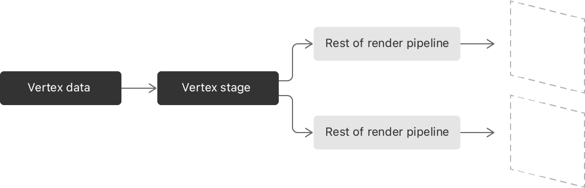

# 将输入数据渲染到多个图层

某些场景需要从一组输入数据生成多个图元，例如：
* 实现 [实时阴影CSM](https://zhuanlan.zhihu.com/p/53689987) 的图形技术，可能会多次渲染相同的模型对象（每个阴影渲染一次）；
* 虽然通过多个渲染管道的方案也可以实现，但这种方案针对每个渲染管道编码相同的绘图命令，并且可能需要 GPU 多次从内存中获取输入数据；

那么如何高效地将一批数据渲染到多个图层或视口呢？使用顶点引申，可以创建从输入数据生成多个顶点流的绘图命令。



* 当 GPU 执行 `vertex amplification` 命令时，会向光栅化着色器发送多个图元；
* GPU 多次调用顶点着色器，每个输出流的每个顶点调用一次；
* 由于所有顶点输出的计算都是相同的，如果一个字段的计算可以共享，那么 GPU 只需计算一次然后共享计算结果，减少了GPU的工作负载；
* 当开发者编写顶点着色器时，编译器会自动检测何时必须单独计算自定义值，但开发者也可以显式地将计算标记为共享。


`vertex amplification` 通常与分层渲染或多视口渲染结合使用，以便GPU将每个输出图元渲染到不同的纹理层或视口。


# 1、检查是否支持 `Vertex Amplification`

并非所有 GPU 都支持`Vertex Amplification`。

```
/// 在设备对象上调用下述方法，传入输出流的数量
/// 如果设备对象可以支持指定数量的输出流，则返回 YES
Boolean useVertexAmplification = [_device supportsVertexAmplificationCount:2];
```

# 2、在顶点着色器实现 `Vertex Amplification`

实现 `vertex amplification` :
* 添加参数 `amplification_count` 指示输出流的数量；
* 添加参数 `amplification_id` 指示输出流的索引；索引值范围 `[0, amplification_count-1]`；

默认情况下，GPU 仅仅调用顶点着色器一次，`amplification_count = 1`，`amplification_id = 0`。

```
/** 要定制每个输出流的行为，需要传入每个流的输入数据，并使用 `amplification_id` 来选择数据
 * @param view_proj 输入的投影矩阵数组
 *       根据索引拿到对应的投影矩阵，可以得到不同的输出流
 */
vertex MyVertexOut myVertex(MyVertexIn in [[stage_in]],
                            constant float4x4 view_proj[MAX_AMP] ,
                            ushort amp_id [[amplification_id]],
                            ushort amp_count [[amplification_count]],
                            ...)
{
    MyVertexOut vert;
    vert.position  = view_proj[amp_id] * in.position;
    
    return vert;
}
```

# 3、确定哪些计算必须不同

`vertex amplification` 相对于实例化的一个主要好处是它如何优化你发送给GPU的工作。
* GPU 只需读取输入流一次，并根据需要执行计算以产生输出流；
* 如果编译器确定在顶点输出流之间共享特定计算，则它计算一次并共享计算结果；
* 在某些情况下，需要在着色器中显式标记输出值是共享的；


顶点着色器的输出数据总是包含一个带有位置属性的字段，并且Metal总是将该数据标记为非共享的。如果将另一个内置属性分配给任何字段，则Metal将该字段标记为共享。

只有当编译器能够证明顶点着色器以相同的方式编译所有输出流的输出值时，编译器才会将其他输出值标记为共享。例如:
* 如果编译器遇到依赖于`amplification_id`的计算字段，它会将该字段标记为非共享字段:

```
MyVertexOut vert;
vert.ampData   = data[amp_id]; // 非共享
```

* 如果输出值只是从输入流复制，编译器会将输出标记为共享:

```
MyVertexOut vert;
vert.normal    = in.normal; // 共享
```

要显式地告诉编译器仅仅计算一次输出字段，需要将 `shared` 属性添加到参数中。

# 4、配置渲染管道

使用 `Vertex Amplification` 还需要在渲染管道做一些配置！


```
MTLRenderPipelineDescriptor *pipelineStateDescriptor = [[MTLRenderPipelineDescriptor alloc] init];
pipelineStateDescriptor.vertexFunction = vertexFunction;
pipelineStateDescriptor.fragmentFunction = fragmentFunction;

/// 设置渲染管道可以处理的最大输出流数量
[pipelineStateDescriptor setMaxVertexAmplificationCount: 2];
```

# 5、在绘图命令编码前设置 `amplification` 

要在 `-draw` 命令中使用 `vertex amplification`，想要在编码命令之前调用 `-setVertexAmplificationCount:viewMappings:` 指定要生成的顶点数。
计数必须小于或等于创建渲染管道时设置的最大值。

此外，由于 `vertex amplification` 几乎总是用于渲染到不同的层或视图，通常必须为每个输出顶点指定目标的索引。
渲染目标和视口数组索引总是在顶点着色器中计算一次(因为它们使用一个内置属性，如上所述)。
通过创建偏移数组并将其作为第二个参数传递，来修改每个输出图元的最终索引。

下面的代码创建了两个映射，并配置了 `-draw` 调用来使用 `vertex amplification`:

```
MTLVertexAmplificationViewMapping mappings[2];
mappings[0].viewportArrayIndexOffset = 1
mappings[0].renderTargetArrayIndexOffset = 0;
mappings[1].viewportArrayIndexOffset = 2
mappings[1].renderTargetArrayIndexOffset = 1;

/// 开始编码前，必须指定生成的顶点数量
[renderEncoder setVertexAmplificationCount:2 viewMappings: mappings];
```

下面的顶点着色器将视口数组索引设置为 1。在 GPU 运行顶点着色器之后，它添加了上面提供的偏移量，所以第一个输出流的图元的视口数组索引是2，第二个的视口数组索引是3。


```
struct MyVertexOut {
    ushort viewport [[viewport_array_index]]; // Implicitly shared.
};

vertex MyVertexOut myVertex(MyVertexIn in [[stage_in]],
                            constant float4x4 view_proj[MAX_AMP] ,
                            ushort amp_id [[amplification_id]],
                            ushort amp_count [[amplification_count]]
                            )
{
    MyVertexOut vert;

    vert.viewport  = 1;
    return vert;
}


fragment float4 myFragment(MyVertexOut in [[ stage_in ]],
                           ushort amp_id [[amplification_id]],
                           ushort amp_count [[amplification_count]]) {
    //   The provided view offsets were: {{1,0},{2,1}}
    //   when amp_id == 0, in.viewport == 2
    //   when amp_id == 1, in.viewport == 3

}
```

# 6、结合 `vertex amplification` 和实例化

图元实例化是从单个输入数据流生成多个顶点输出流的另一种方法。
开发者提供共享的顶点数据和指定如何渲染模型的每个实例数据。
例如，使用一组模型数据，但是提供不同的姿势数据来分别动画模型的每个版本。


当执行一个实例计数为 `10` 的 `-draw` 调用时，GPU会生成10个输出流。与 `vertex amplification`  不同，图元实例化在每次调用顶点着色器时都要重新计算所有顶点输出。

开发者可以安全轻松地结合 `vertex amplification` 和图元实例化。
使用这个组合来分离实例化概念(如场景中的角色数量)和渲染概念(如阴影映射目标之间的区别)。
Metal 生成的输出流数量等于`vertex amplification`计数和实例计数的乘积。
例如，如果在`vertex amplification`计数为2、实例计数为10的情况下执行draw调用，GPU会调用顶点着色器20次——每个实例调用2次。它计算共享的输出值从`vertex amplification`每个实例一次。
