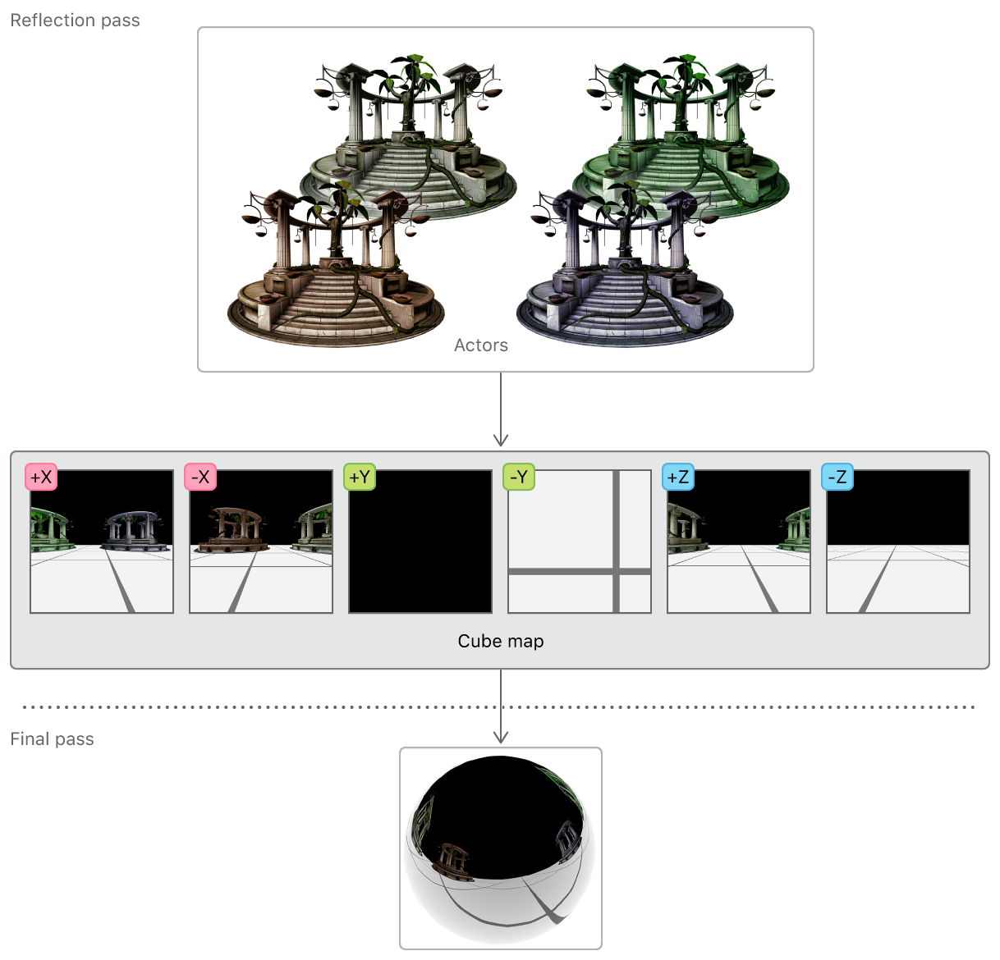
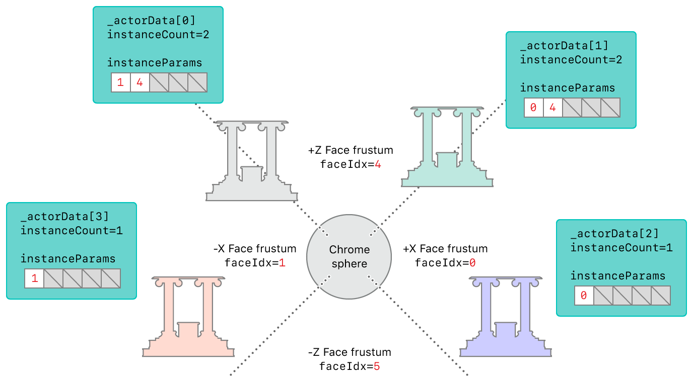
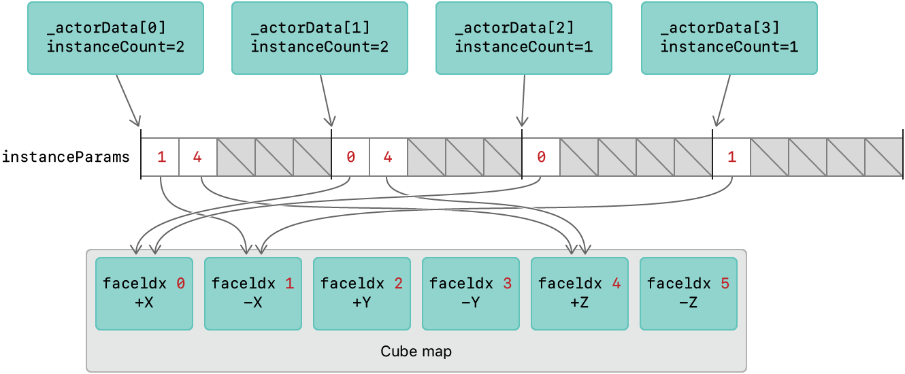

# 使用更少的渲染通道渲染反射

使用 layer selection 减少生成环境地图所需的渲染通道的数量。

[Demo](https://developer.apple.com/documentation/metal/rendering_reflections_with_fewer_render_passes?language=objc) 演示了在铬球上的动态反射，使用 layer selection 在两个通道来渲染。
* 第一次将环境呈现到地图上。
* 第二次将周围环境反射到球体上；它在场景中呈现额外的演员；它渲染了环境本身。


通过从地图环境对其反射进行采样，可以实现反射其环境的对象。一个立方体贴图是一个单一的纹理，由6个二维纹理层组成，按立方体的形状排列。反射会根据环境中其他物体的位置而变化，所以立方体地图的每一个面都必须在每一帧中动态渲染。这通常需要6个独立的渲染通道，每个通道对应一个面，但Metal允许你在单个通道中渲染整个立方体地图。



## 开始

macOS 系列的 GPU 都支持图层选择，但 iOS 系列的 GPU 仅部分支持：
* 其中支持 MTLFeatureSet_iOS_GPUFamily5_v1 功能集的 iOS GPU 一定支持 Layer Selection 功能；

``` 
- (void)viewDidLoad {
    [super viewDidLoad];
    
#if TARGET_IOS
    /// iOS 需要判断是否支持 Layer Selection
    supportsLayerSelection = [_view.device supportsFeatureSet:MTLFeatureSet_iOS_GPUFamily5_v1];
    NSAssert(supportsLayerSelection, @"Sample requires iOS_GPUFamily5_v1 for Layer Selection");
#endif

}
```

## 分离场景

A cube map is represented as a render target array with six layers, one for each of its faces. The `[[render_target_array_index]]` attribute qualifier, specified for a structure member of a vertex function return value, identifies each array layer separately. This layer selection feature allows the sample to decide which part of the environment gets rendered to which cube map face.

一个立方体地图被表示为一个具有六层的渲染目标阵列，每层对应一个面。
`[[render_target_array_index]]` 属性限定符，为顶点函数返回值的结构成员指定，分别标识每个数组层。
这个图层选择功能允许样本决定环境的哪一部分被渲染到哪个立方体地图面。


立方体贴图表示为具有六层的渲染目标阵列，每个面一层。
为顶点函数返回值的结构成员指定的属性限定符分别标识每个数组层。
此图层选择功能允许样本决定将环境的哪个部分渲染到哪个立方体贴图面。


An `AAPLActorData` object represents an actor in the scene. In this sample, each actor is a temple model with the same mesh data but a different diffuse color. These actors sit on the XZ-plane; they're always reflected in the X or Z direction relative to the sphere and could be rendered to any of the +X, -X, +Z, or -Z faces of the cube map.

一个' AAPLActorData '对象表示场景中的一个参与者。在这个示例中，每个actor都是一个temple模型，具有相同的网格数据，但漫反射颜色不同。这些演员坐在xz飞机上;它们总是在相对于球体的X或Z方向反射，并可以渲染到立方体映射的任何+X， -X， +Z或-Z面。

一个对象代表场景中的一个演员。在此示例中，每个演员都是一个寺庙模型，具有相同的网格数据但具有不同的漫反射颜色。这些演员坐在 XZ 平面上；它们总是在相对于球体的 X 或 Z 方向上反射，并且可以渲染到立方体贴图的任何 +X、-X、+Z 或 -Z 面。AAPLActorData


## 为反射通道执行筛选测试

Before rendering to the cube map, it's useful to know which faces each actor should be rendered to. Determining this information involves a procedure known as a *culling test*, and it's performed on each actor for each cube map face.

在渲染到立方体映射之前，知道每个参与者应该渲染到哪个面是很有用的。确定这一信息涉及一个称为“筛选测试”的过程，它在每个立方体映射面的每个参与者上执行。

在渲染到立方体贴图之前，了解每个演员应该渲染到哪些面是很有用的。确定这些信息涉及一个称为剔除测试的过程，它在每个角色的每个立方体贴图面上执行。


At the start of every frame, for each cube map face, a view matrix is calculated and the view's frustum is stored in the `culler_probe` array.


在每一帧的开始，对于每个立方体映射面，一个视图矩阵被计算，视图的截屏被存储在' culler_probe '数组中。

在每一帧开始时，对于每个立方体贴图面，都会计算一个视图矩阵，并将视图的截头体存储在数组中。culler_probe


``` 
// 1) 获得视图矩阵: 指定球更新位置的面
viewMatrix[i] = _cameraReflection.GetViewMatrixForFace_LH (i);

/// 2) 使用更新的视图矩阵计算包围截锥的平面
///    稍后将使用这些平面来测试角色的边界球是否与视景体（一个锥台）相交，并因此在该面的视口中可见
culler_probe[i].Reset_LH (viewMatrix [i], _cameraReflection);
```


These culler probes test the intersection between an actor and the viewing frustum of each cube map face. The test results determine how many faces the actor is rendered to (`instanceCount`) in the reflection pass, and which faces (`instanceParams`) it's rendered to.

这些剔除器探针测试演员和每个立方体贴图面的视锥体之间的交集。测试结果决定了演员在反射过程中被渲染到 ( ) 的面数，以及它被渲染到的面 ( )。instanceCountinstanceParams

这些culler探头测试参与者和每个立方体地图面的视锥体之间的交集。测试结果确定参与者在反射传递中被渲染到(' instanceCount ')多少个面，以及它被渲染到哪些面(' instanceParams ')。


``` objective-c
if (_actorData[actorIdx].passFlags & EPassFlags::Reflection)
{
    int instanceCount = 0;
    for (int faceIdx = 0; faceIdx < 6; faceIdx++)
    {
        // Check if the actor is visible in the current probe face
        if (culler_probe [faceIdx].Intersects (_actorData[actorIdx].modelPosition.xyz, _actorData[actorIdx].bSphere))
        {
            // Add this face index to the the list of faces for this actor
            InstanceParams instanceParams = {(ushort)faceIdx};
            instanceParams_reflection [MaxVisibleFaces * actorIdx + instanceCount].viewportIndex = instanceParams.viewportIndex;
            instanceCount++;
        }
    }
    _actorData[actorIdx].instanceCountInReflection = instanceCount;
}
```

The following diagram shows the results of the culling tests performed on the temple actors, based on their positions relative to the reflective sphere. Because `_actorData[0]` and `actorData[1]` bisect two viewing frustums, their `instanceCount` property is set to 2, and there are two elements in their `instanceParams` array. (This array contains the cube map face indices of the viewing frustums that the actors intersect.)

下图显示了对寺庙演员进行的筛选测试的结果，基于他们相对于反射球的位置。因为' _actorData[0] '和' actorData[1] '平分两个视图截屏，他们的' instanceCount '属性被设置为2，并且在他们的' instanceParams '数组中有两个元素。(该数组包含演员相交的视图截锥的立方体映射面索引。)

下图显示了根据寺庙演员相对于反射球体的位置对他们进行剔除测试的结果。因为与平分两个视平截头体，其属性被设置为2，并且有其在两个元件阵列。（此数组包含演员相交的视锥体的立方体贴图面索引。）_actorData[0]actorData[1]instanceCountinstanceParams




## 为反射通道配置渲染目标

The render target for the reflection pass is a cube map. The sample configures the render target by using a `MTLRenderPassDescriptor` object with a color render target, a depth render target, and six layers. The `renderTargetArrayLength` property sets the number of cube map faces and allows the render pipeline to render into any or all of them.

``` objective-c
reflectionPassDesc.colorAttachments[0].texture    = _reflectionCubeMap;
reflectionPassDesc.depthAttachment.texture        = _reflectionCubeMapDepth;
reflectionPassDesc.renderTargetArrayLength        = 6;
```

## 发出反射通道的绘制调用

The `drawActors:pass:` method sets up the graphics rendering state for each actor. Actors are only drawn if they are visible in any of the six cube map faces, determined by the `visibleVpCount` value (accessed through the `instanceCountInReflection` property). The value of `visibleVpCount` determines the number of instances for the instanced draw call.

``` objective-c
[renderEncoder drawIndexedPrimitives: metalKitSubmesh.primitiveType
                          indexCount: metalKitSubmesh.indexCount
                           indexType: metalKitSubmesh.indexType
                         indexBuffer: metalKitSubmesh.indexBuffer.buffer
                   indexBufferOffset: metalKitSubmesh.indexBuffer.offset
                       instanceCount: visibleVpCount
                          baseVertex: 0
                        baseInstance: actorIdx * MaxVisibleFaces];
```

In this draw call, the sample sets the `baseInstance` parameter to the value of `actorIdx * 5`. This setting is important because it tells the vertex function how to select the appropriate render target layer for each instance.

## Render the Reflection Pass

In the `vertexTransform` vertex function, the `instanceParams` argument points to the buffer that contains the cube map faces that each actor should be rendered to. The `instanceId` value indexes into the `instanceParams` array.

``` metal
vertex ColorInOut vertexTransform (const Vertex in                               [[ stage_in ]],
                                   const uint   instanceId                       [[ instance_id ]],
                                   const device InstanceParams* instanceParams   [[ buffer     (BufferIndexInstanceParams) ]],
                                   const device ActorParams&    actorParams      [[ buffer (BufferIndexActorParams)    ]],
                                   constant     ViewportParams* viewportParams   [[ buffer (BufferIndexViewportParams) ]] )
```

The output structure of the vertex function, `ColorInOut`, contains the `face` member that uses the `[[render_target_array_index]]` attribute qualifier. The return value of `face` determines the cube map face that the render pipeline should render to.

``` metal
struct ColorInOut
{
    float4 position [[position]];
    float2 texCoord;

    half3  worldPos;
    half3  tangent;
    half3  bitangent;
    half3  normal;
    uint   face [[render_target_array_index]];
};
```

Because the value of the draw call's `baseInstance` parameter is set to `actorIdx * 5`, the `instanceId` value of the first instance drawn in the draw call is equal to this value. Each subsequent rendering of an instance increments the `instanceId` value by 1. The `instanceParams` array has five slots for each actor because an actor can be visible in up to five cube map faces. As a result, the `instanceParams[instanceId]` element always contains one of the face indices in which the actor is visible. Therefore, the sample uses this value to select a valid render target layer.

``` metal
out.face = instanceParams[instanceId].viewportIndex;
```

In summary, to render each actor to the reflective cube map, the sample issues an instanced draw call for the actor. The vertex function uses the built-in `instanceId` variable to index into the `instanceParams` array that contains the index of the cube map face that the instance should be rendered to. Therefore, the vertex function sets this face index in the `face` return value member, which uses the `[[render_target_array_index]]` attribute qualifier. This ensures that each actor is rendered to each cube map face it should appear in.



## Perform Culling Tests for the Final Pass

The sample performs similar view updates for the main camera in the final pass. At the start of every frame, a view matrix is calculated and the view's frustum is stored in the `culler_final` variable.

``` objective-c
_cameraFinal.target   = SceneCenter;

_cameraFinal.rotation = fmod ((_cameraFinal.rotation + CameraRotationSpeed), M_PI*2.f);
matrix_float3x3 rotationMatrix = matrix3x3_rotation (_cameraFinal.rotation,  CameraRotationAxis);

_cameraFinal.position = SceneCenter;
_cameraFinal.position += matrix_multiply (rotationMatrix, CameraDistanceFromCenter);

const matrix_float4x4 viewMatrix       = _cameraFinal.GetViewMatrix();
const matrix_float4x4 projectionMatrix = _cameraFinal.GetProjectionMatrix_LH();

culler_final.Reset_LH (viewMatrix, _cameraFinal);

ViewportParams *viewportBuffer = (ViewportParams *)_viewportsParamsBuffers_final[_uniformBufferIndex].contents;
viewportBuffer[0].cameraPos            = _cameraFinal.position;
viewportBuffer[0].viewProjectionMatrix = matrix_multiply (projectionMatrix, viewMatrix);
```

This final culler probe is used to test the intersection between an actor and the viewing frustum of the camera. The test result simply determines whether or not each actor is visible in the final pass.

``` objective-c
if (culler_final.Intersects (_actorData[actorIdx].modelPosition.xyz, _actorData[actorIdx].bSphere))
{
    _actorData[actorIdx].visibleInFinal = YES;
}
else
{
    _actorData[actorIdx].visibleInFinal = NO;
}
```

## Configure Render Targets for the Final Pass

The render target for the final pass is the view's *drawable*, a displayable resource obtained by accessing the view's `currentRenderPassDescriptor` property. However, you must not access this property prematurely because it implicitly retrieves a drawable. Drawables are expensive system resources created and maintained by the Core Animation framework. You should always hold a drawable as briefly as possible to avoid resource stalls. In this sample, a drawable is acquired just before the final render pass is encoded.

``` objective-c
MTLRenderPassDescriptor* finalPassDescriptor = view.currentRenderPassDescriptor;

if(finalPassDescriptor != nil)
{
    finalPassDescriptor.renderTargetArrayLength = 1;
    id<MTLRenderCommandEncoder> renderEncoder =
    [commandBuffer renderCommandEncoderWithDescriptor:finalPassDescriptor];
    renderEncoder.label = @"FinalPass";

    [self drawActors: renderEncoder pass: EPassFlags::Final];

    [renderEncoder endEncoding];
}
```

## 最后调用

方法 `-drawActors:pass` 设置每个actor的图形渲染状态。actor 只有在主镜头可见时才被绘制，由 `visibleVpCount` 决定 (通过`visibleInFinal`属性访问)。

由于每个actor在最后一次循环中只绘制一次，所以 `instanceCount` 参数总是被设置为1，`baseInstance` 参数总是被设置为0。


## Render the Final Pass

将最终帧直接渲染给视图的可绘制对象，然后显示在屏幕上。

``` objective-c
[commandBuffer presentDrawable:view.currentDrawable];
```
