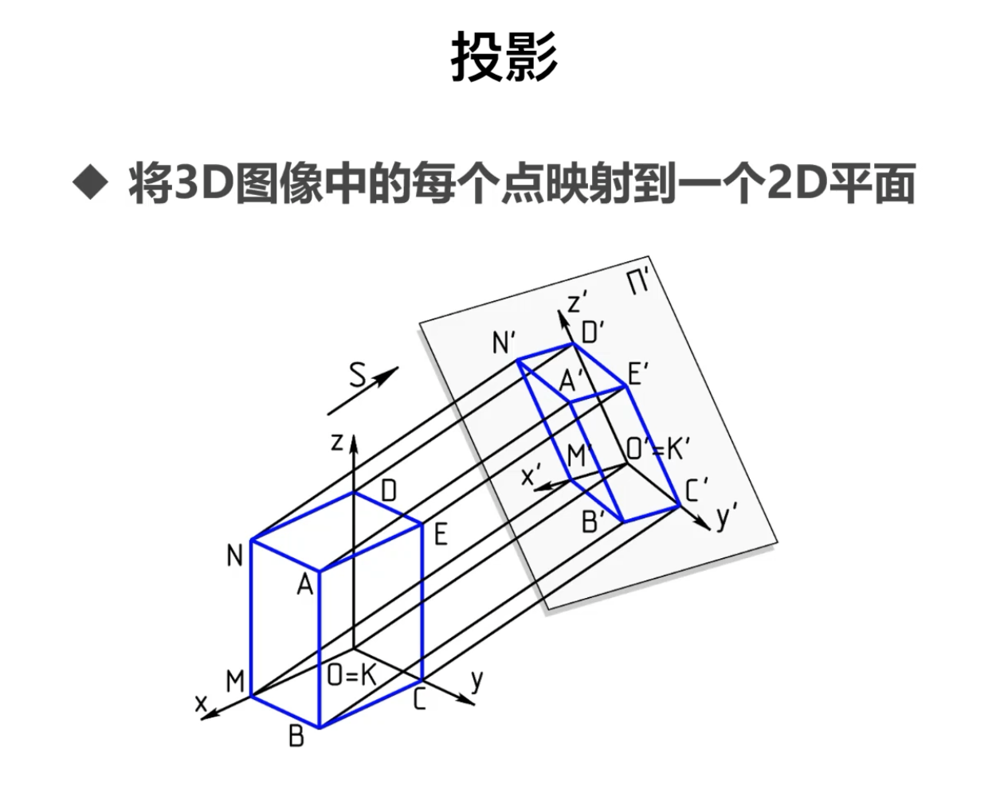
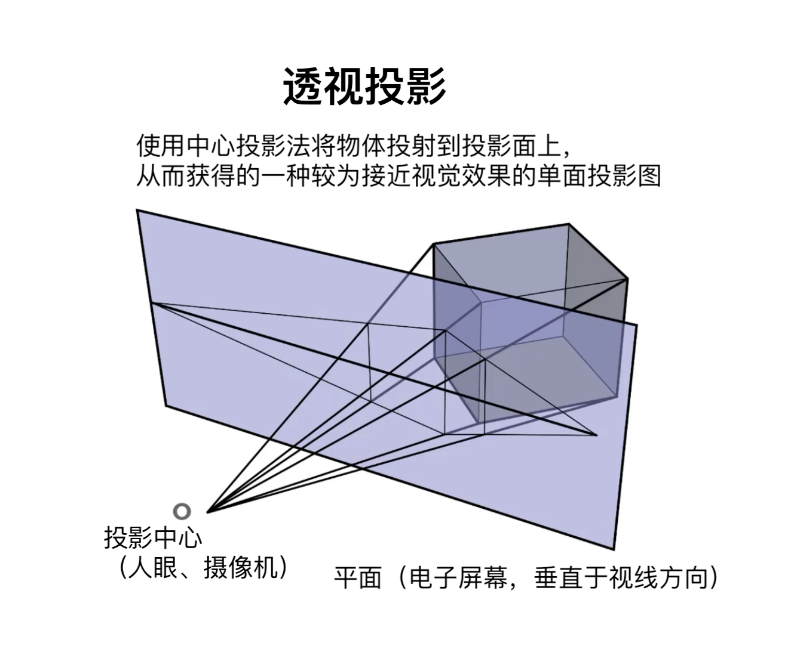
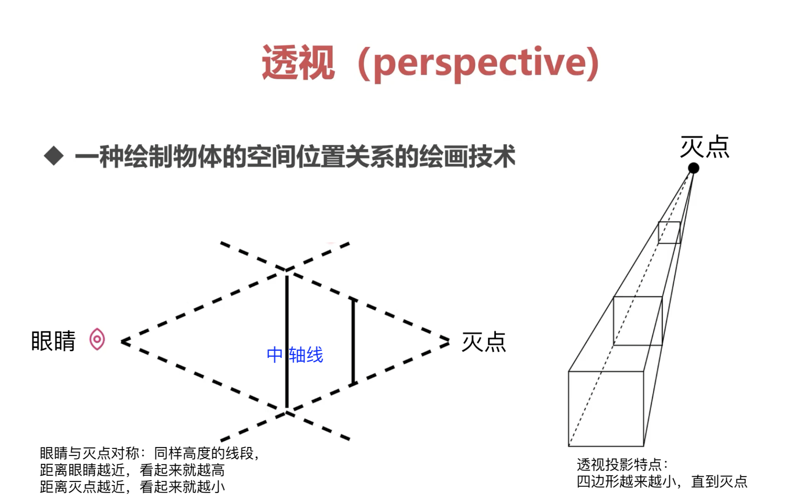
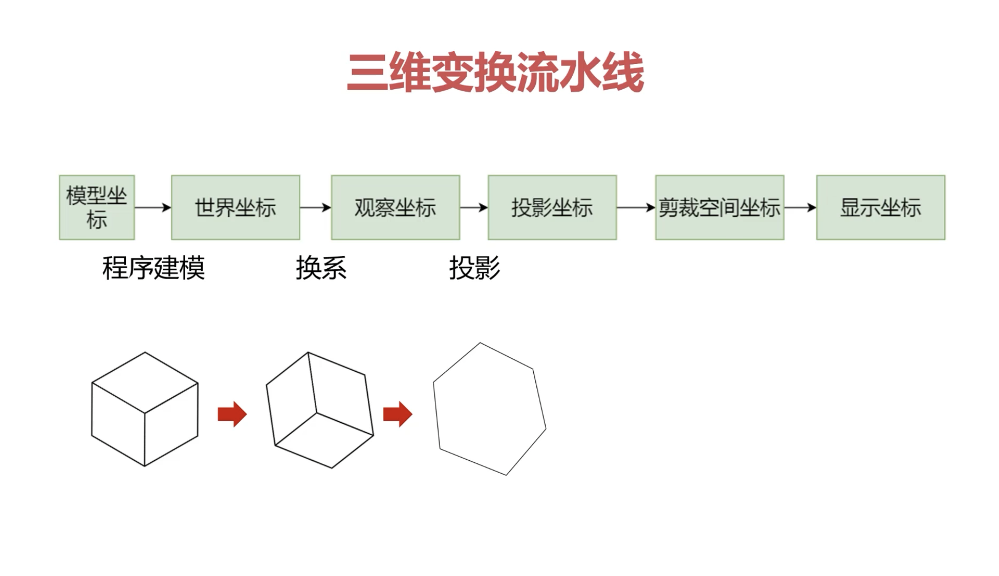
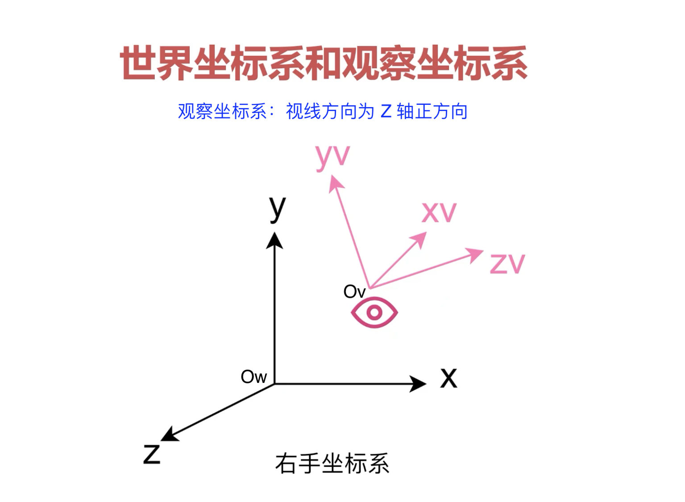
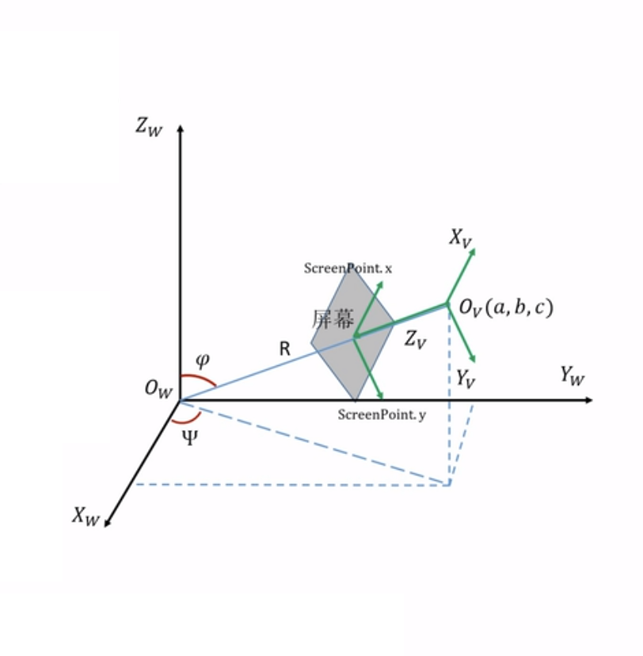
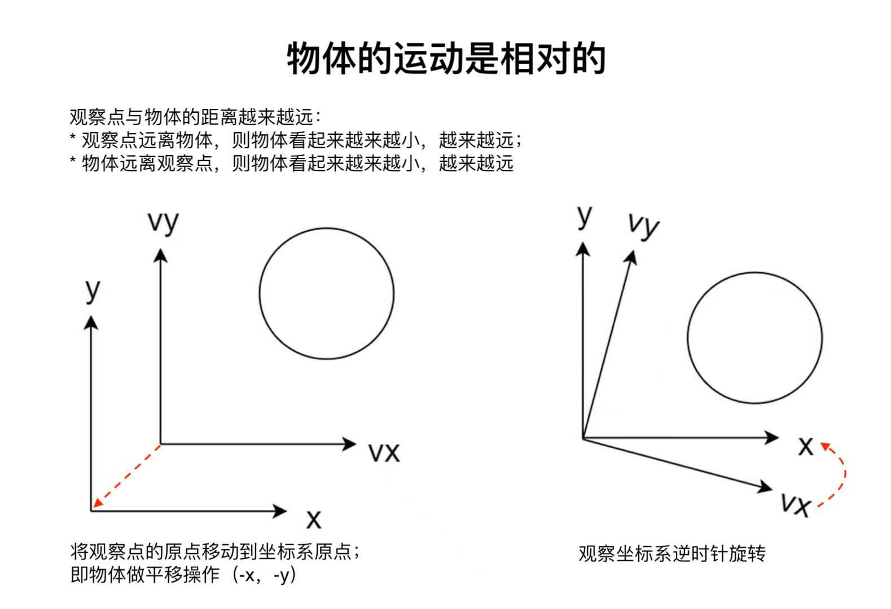
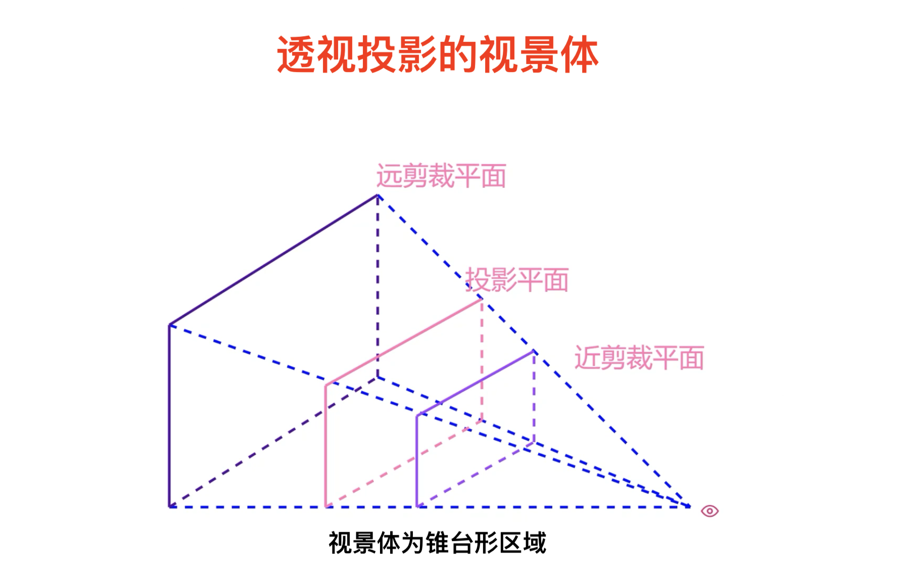
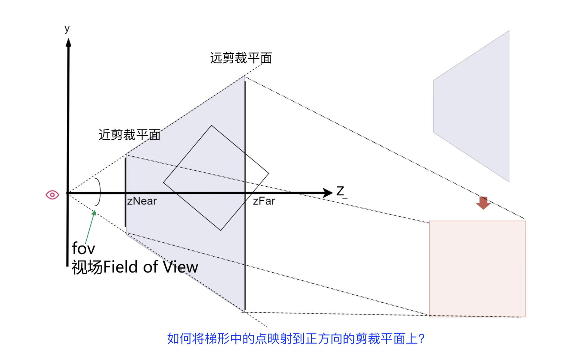
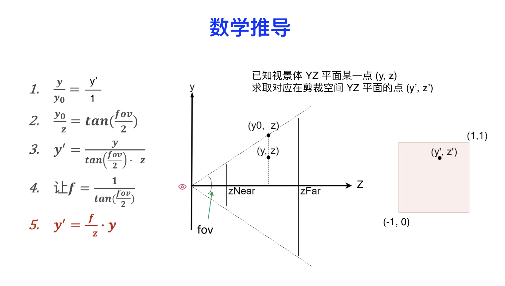

# 三维空间的投影

投影就是从投影中心发出射线，经过三维物体上的每一个点之后，与投影面相交所形成的交点集合。

投影变换：从数学角度观察，投影就是将三维坐标转变为二维坐标的过程；也就是说：投影的本质就是降维！

# 1、投影分类

* 当投影中心到投影面的距离为无穷大时，可以使用平行投影；
* 当投影中心到投影面的距离为有限值时，适用于透视投影；

## 1.1、平行投影

> 平行投影：每个点的投影方向一致！



根据投影方向与投影面的关系，可以分为：
* 斜投影：
* 正交投影：投影方向和投影平面垂直！

## 1.2、透视投影

透视投影：使用中心投影法将物体投射到投影面上，从而获得的一种较为接近视觉效果的单面投影图！



根据屏幕切割世界坐标系的坐标轴数量，可以分为：
* 一点透视；
* 二点透视；
* 三点透视；

### 1.2.1、灭点

模拟人的眼睛于一个点，透过一个平面观察立方体！



按照透视投影的规则：观察的四边形，随着视线的延伸，会越来越小，直到变成一个点（灭点），然后消失；这是一种 ‘近大远小’ 的观察效果！

以中轴线为分界线，眼睛与灭点之间可以看作对称的效果；同样高度的线段，随着距离眼睛越近，看起来就越高；随着距离灭点越近，看起来就越小！


__灭点__ ：在透视投影中，一束平行于投影面的平行线投影可以保持平行，而不平行于投影面的平行线的投影会聚集到一个点，这个点成为灭点（Vanishing Point）。

* 灭点可以看作是无限远处的一点在投影面上的投影。
* 如果是平行透视，只有一个灭点，在对象中间的后方。方法是延长物体左右纵深的两条有会聚趋势的线，向后方会聚于一点，平行透视能产生纵深感。
* 如果是成角透视，有两个灭点，在对象的两侧的后方；
方法是分别延长物体左右两方的有会聚趋势的四条线，两两交于对象左右两边的后方，形成两个灭点；
成角透视是最符合视觉习惯的透视，很富有立体感；
凡是平行于画面的直线都没有灭点，凡是与画面有一定角度的一组平行线，都有灭点。
如果这个角度是90度，就是平行透视；否则是成角透视。


影灭点——正面自然光照射，阴影向后的消失点。标识为VS（Vanishingofshadow），光灭点——影灭点向下垂直于触影面的点。标识为VL（Vanishingoflight）


# 2、三维变换流水线



在整个渲染管线中，一个顶点可能会经历一下六种坐标空间之间的转换：

* 1、模型坐标：模型坐标表示的是模型中所有点相对于模型本身原点的一个坐标系；属于右手坐标系；
* 2、世界坐标：世界坐标是指模型中每个点，相对于世界坐标系原点的一个坐标位置；属于右手坐标系；
* 3、观察坐标（相机坐标或者人眼坐标）：在世界坐标中的模型，相对于观察坐标的映射；右手或者左手坐标系；
* 4、投影坐标：投影的最终目的是将一个三维物体展示在 __二维平面的剪裁空间__ 里；属于左手坐标系；
    如果是正交投影，可以将剪裁空间想象为一个立方体空间；
    如果是透视投影，则剪裁空间是一个锥体，物体呈现方式就是近大远小的效果；
* 5、NDC坐标：将剪裁空间坐标系的结果进行归一化；属于左手坐标系；
    在 Metal 中`(x,y)` 取值范围 `[-1,1]`, `z` 取值范围 `[0,1]`；
    在 OpenGL 中，`Z` 轴的取值范围为 `[-1,1]` 且使用右手坐标系
* 6、屏幕坐标：所有顶点最终会转换成在屏幕坐标系上的一个坐标


```
/// 保存常量数据
typedef struct {
    matrix_float4x4 worldMatrix; /// 模型从模型坐标转换到世界坐标：平移、旋转、缩放等最终形成的复合变换
    matrix_float4x4 viewMatrix; ///  世界坐标到相机坐标上的转换：两个坐标系的切换
    matrix_float4x4 projectionMatrix; /// 透视投影：使得在平面上产生物体近大远小的效果
} Uniforms;
```

## 2.1、世界坐标系与观察坐标系

从模型坐标，到世界坐标的转换，可以通过矩阵的平移、旋转来轻松实现！

从世界坐标系到观察坐标系的转换，稍显复杂些！因为观察点（眼睛或相机）是随时移动的，我们需要一个算法，通过给定眼睛的位置、视线的方向，来求出此刻的复合变换矩阵！



在观察坐标系中:
* 观察点在坐标原点；
* 视线方向为 Z 轴的正方向：
* 可以是右手坐标系、也可以是左手坐标系；如果是右手坐标系，需要在剪裁空间之前转为左手坐标系；
* `XY` 平面和 `Z` 垂直；

### 2.1.1、世界坐标系到观察坐标系的公式推导



> 物体的运动是相对的！

当物体与观察点的距离越来越大时，可能是：
* 物体在远离观察点，所以看起来“物体越来越远、越来越小”；
* 观察点在远离物体，所以看起来“物体越来越远、越来越小”；

物体和观察坐标的相对位置不会发生变换，仅仅求出观察坐标系到世界坐标系的转换矩阵，再将此矩阵用于物体，就能得出观察坐标系下的物体坐标！



__世界上的物体运动是相对的__ :随着观察点在世界的移动，观察到的物体也会变得有所不同；
* 如：观察点向 `X` 轴的正方向移动，则物体相对而言应该向 `X` 轴的负方向移动；
* 如：沿着 `X` 轴逆时针旋转，观察点向上移动，物体相对向下移动；


三维空间中世界坐标系的点如何转换到观察坐标系？
* 1、将观察点在世界坐标系的位置 `(x, y, z)` 平移 `(-x, -y, -z)` 到世界坐标系的原点；使观察坐标系的原点与世界坐标系的原点重合；
* 2、观察点 `x, y, z` 三个方向分别相对于世界坐标系 __逆时针__ 旋转了 `(ax, ay, az)`
 * 2.1、旋转 `Vx` 轴 `-ax`，将 `Vz` 轴旋转到 `XZ` 平面上；
 * 2.2、旋转 `Vy` 轴 `-ay`，将 `Vz` 轴于 `Z` 轴重叠；
 * 2.3、旋转 `Vz` 轴 `-az`，将 `Vx` 与 `X` 轴、`Vy` 与 `Y` 轴重叠；
 
```
/// 矩阵变换：平移、旋转
 matrix_float4x4 lookAt(float eyeX, float eyeY, float eyeZ,
                        float angleX, float angleY, float angleZ) {
    matrix_float4x4 matrix = matrix_multiply(matrix4x4_identity(), matrix4x4_translation(-eyeX, -eyeY, -eyeZ));
    matrix = matrix_multiply(matrix, matrix4x4_rotationX(-angleX));
    matrix = matrix_multiply(matrix, matrix4x4_rotationY(-angleY));
    matrix = matrix_multiply(matrix, matrix4x4_rotationZ(-angleZ));
    return matrix;
}
```

## 2.2、观察坐标系下的视景体



* 距离观察点较近的平面为 __近剪裁平面__，垂直于观察方向向量，距离为 `zNear` ；
* 距离观察点较远的平面为 __远剪裁平面__，垂直于观察方向向量，距离为 `zFar` ；
* 透视投影的投影线互不平行，相交于视点；因此同样尺寸的物体，近处的投影效果大，远处的投影效果小；从而产生现实世界中 __近大远小__ 的效果；

影响透视投影最终效果的参数：
* 视野的大小：如果视野很窄，则仅能看到物体的某一部分；
* 观察点与近剪裁平面的距离`zNear` ：如果距离太近，超出视野范围，则没必要去处理这部分数据；
* 观察点与远剪裁平面的距离`zFar`：如果距离太远，超过了 `zFar ，也没必要处理这部分数据；

最终处理透视投影：使用近剪裁平面与远剪裁平面，做成一个锥形空间（剪裁空间），在锥形剪裁空间之外的物体不显示，仅显示锥形剪裁空间之内的物体！


### 2.2.1、透视投影公式推导

在视景体中的点，是如何映射到 `Z[0, 1]` 的剪裁空间的 (体积为 `2 * 2 * 1`)？



* 左手坐标系，随着视线看的越来越远，Z 值越来越大；
* 眼睛看到的范围称为 __视场__ `fov`；
* 当 `zNear` 超过 `zFar` 时，将什么也观察不到；



从数学角度而言，透视投影就是对世界坐标系中的每一个点，找出它在屏幕上对应的坐标；该点和视点的连线与屏幕的交点，正是其屏幕坐标！

数学问题：已知视景体的 YZ 平面某一点 `(y, z)`, 求取对应在剪裁空间的 YZ 平面的点 `(y‘, z’)` ！
那么推导过程如下所示：
* 1、根据物体与视野的范围比值，可得关系式 `y / y0 = y' / 1`；
* 2、根据正切函数得到公式  `tan(fov / 2.0) = y0 / z`；
* 3、由此可以推导出 `y' = y / (z * tan(fov / 2.0))`;
* 4、不妨令 `f = 1.0 / tan(fov / 2.0)` ;
* 5、那么有 `y' = f / z * y`;

同样的，在 XZ 平面可以推导出 `x' = x / (z * tan(fovx / 2.0))`;
* 我们的视口 `viewport` 的宽高比为 `aspect = weight / height`;
* 也就是说 `x0 / y0 = aspect`;
* 近一步推出 `tan(fovx / 2.0) / tan(fovy / 2.0) = aspect`;
* 此时：`tan(fovx / 2.0) = aspect * tan(fovy / 2.0) = aspect / f`;
* 所以有：`x' = f / (z * aspect) * x`;

眼睛看到的是近大远小的视觉效果：
* 眼睛看到的 `Z` 值并非成比例的减小；
* 人的视觉：越近越重要，越远越容易忽略；
* 考虑使用曲线来表达 `z'` 与 'z' 的对应关系 `z' = m / z + c`；
* 当 `zFar` 无穷趋近于 `1`，`zNear` 无穷趋近于 `0` 时有

```
m / zFar + c = 1;
m / zNear + c = 0;
```

从而推导出

```
m = zFar * zNear / (zNear - zFar);
c = zFar / (zFar - zNear);
```

* 此时 `z' = (zFar * zNear / (zNear - zFar)) / z + zFar / (zFar - zNear)`；

最终推导出从观察坐标系到剪裁空间的坐标变换：

```
x' = f / (z * aspect) * x;
y' = f / z * y;
z' = (zFar * zNear / (zNear - zFar)) / z + zFar / (zFar - zNear);
/// 其中 f = 1.0 / tan(fov / 2.0)
```

那么如何将上述关系组织为矩阵变换呢？`x', y'`都包含了 `1/z`, 不妨令：

```
x'' = x' * z;
y'' = y' * z;
z'' = z' * z;
``` 

此时有：

```
x'' = f / aspect * y;
y'' = f * y;
z'' = (zFar * zNear / (zNear - zFar)) + zFar / (zFar - zNear) * z;
/// 其中 f = 1.0 / tan(fov / 2.0)
```

相应的透视投影矩阵 `matrix_perspective` 为：

```
float f = tan(M_PI_2 - 0.5 * fovy);
float zs = farZ / (farZ - nearZ);
{
    {f / aspect, 0,  0,           0},
    {         0, f,  0,           0},
    {         0, 0, zs, -nearZ * zs},
    {         0, 0,  1,           0}
}
```

注意：矩阵的 `[3][2] = 1` 是基于图形学引擎的特性而设置的：

```
{x, y, z, 1} * matrix_perspective =

{
    f / aspect * x,
    f * y,
    (zFar * zNear / (zNear - zFar)) + zFar / (zFar - zNear) * z,
    z
}
```

图形学引擎最终会 `xyz / w`，所以最终结果仍为我们推算出的：

```
{
    f / (z * aspect) * x,
    f / z * y,
    (zFar * zNear / (zNear - zFar)) / z + zFar / (zFar - zNear),
    1
}
``` 
