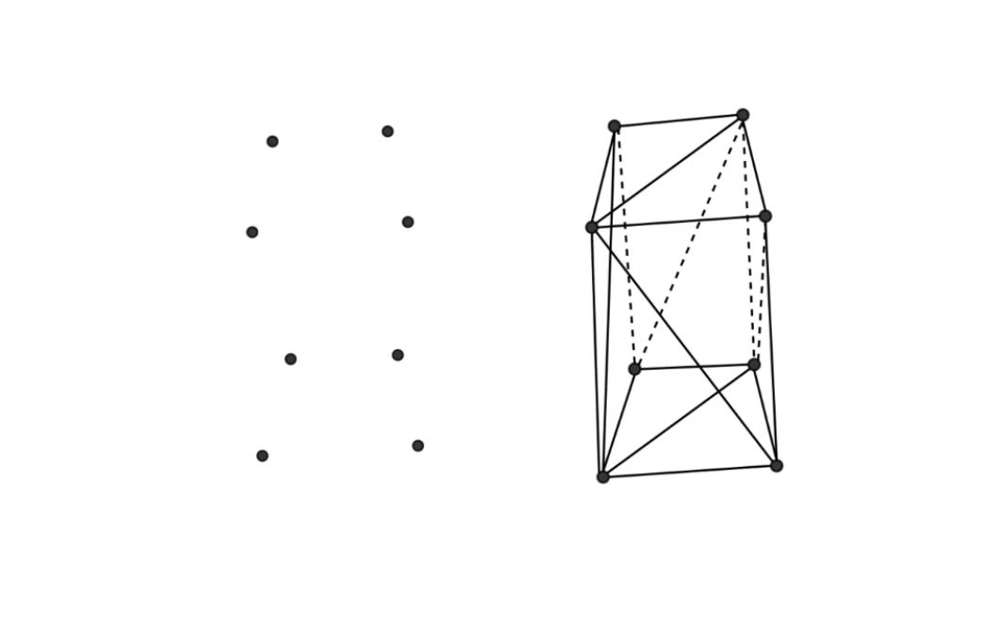
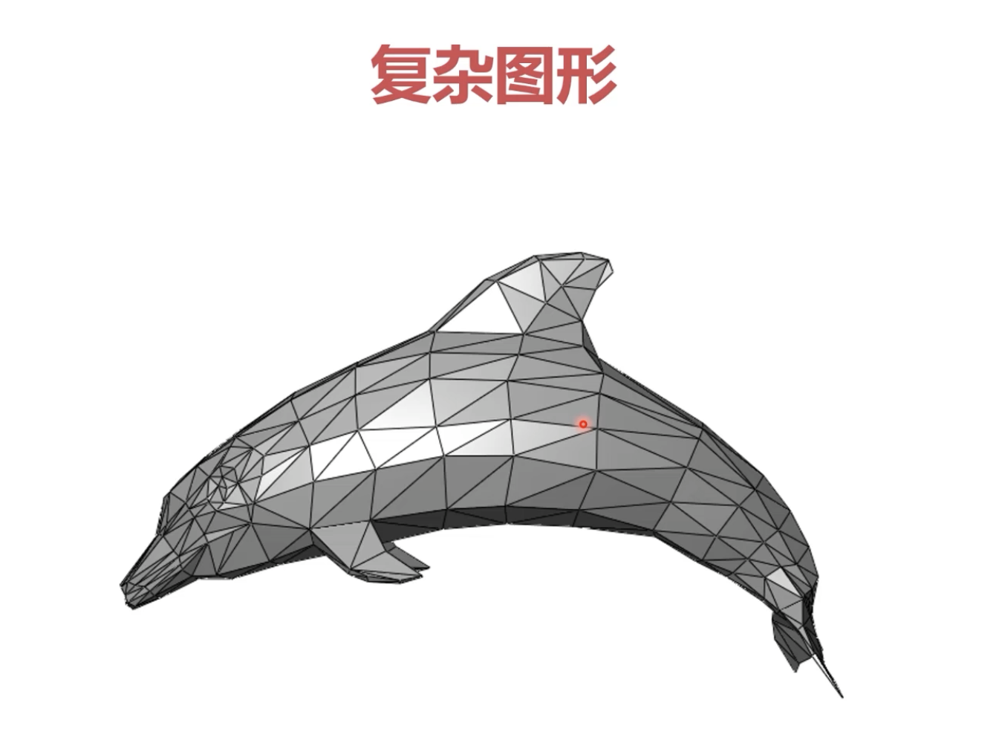
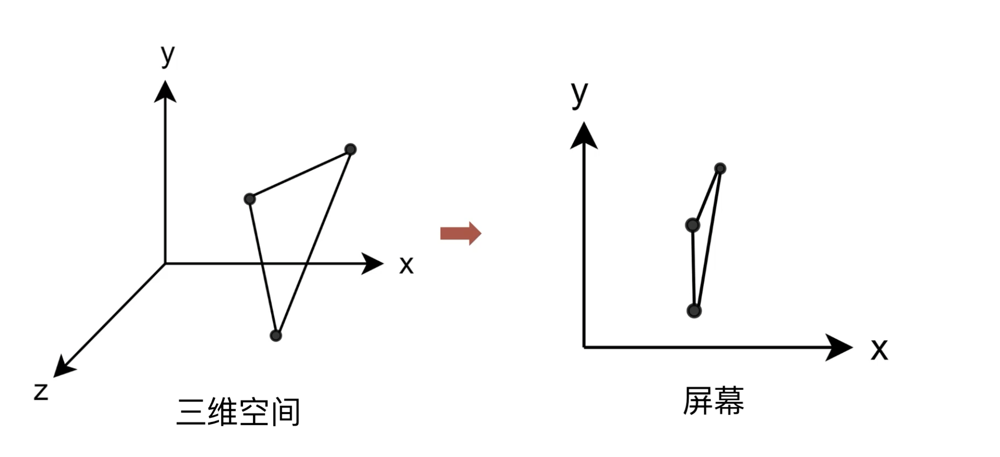
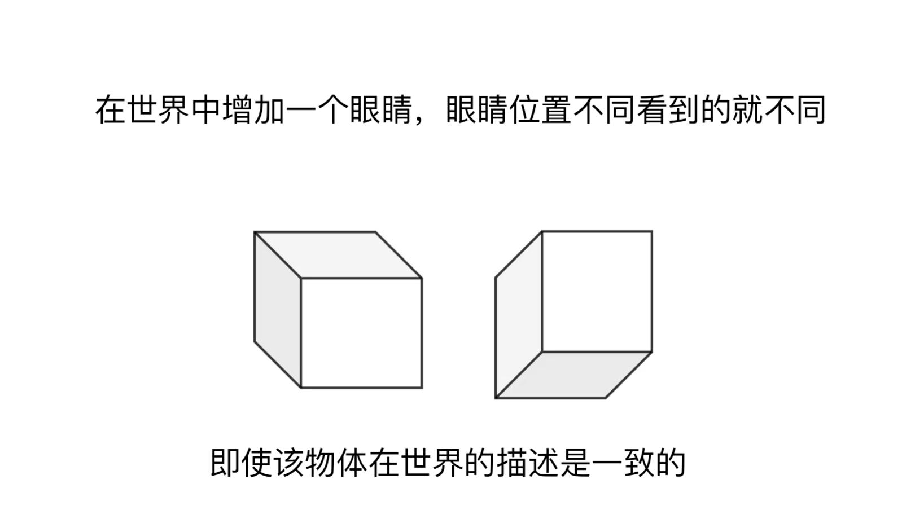
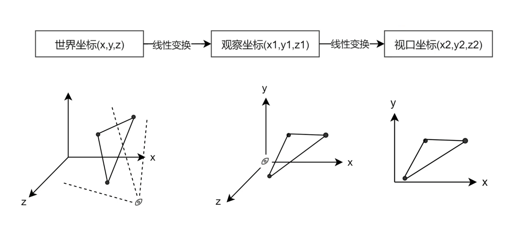

## 三角形网格

三角形网格是一种由顶点集合和索引集合描述图形的方法。
* 最细粒度：由三角形组成；
* 索引：哪些顶点构成一个面；

最细粒度为三角形：
* 三个点可以确定一个面；
* 三个点唯一确定一个三角形；效率高，方便描述；
* 数学模型更加简单（判断投影是否在三角形内）；

# 从顶点到视区

如何将三维空间的一个点显示在屏幕上？
* 在三维空间，通常使用右手坐标系来标记一个点的坐标 `(x, y, z)` ；
* 三个这样的点，就可以构建一个三角形；
* 将三维空间的三角形显示到屏幕会发生形变；

* 本质来讲，图形是建立在三维空间的；
 三维坐标系的原点可以随意设定，`X、Y、Z` 轴的方向也可以随意设定；
 通常称这个空间为世界，设定的坐标系称之为 __世界坐标系__；
* 在世界中增加一个眼睛，眼睛位置不同看到的就不同；即使该物体在世界的描述是一致的；
 眼睛所在的位置也会形成相对于眼睛的坐标系，叫做 __观察坐标系__；
 

  
* 显示到屏幕上的内容，叫做 __视口坐标系__;
* 那么一个顶点 __至少__ 要经过两次变换；

* 由于视角是有限度：
 * 某些物体与眼睛所处位置平行，导致看不到；
 * 某些物体太遥远，也会看不到；
* 视野之外的物体，在图形学中不需要加载到屏幕上，需要剪裁； 
