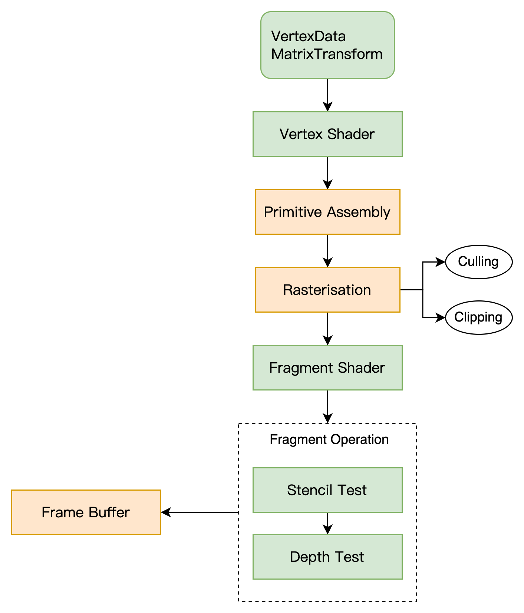

# 图形渲染管道

* 绘制 3D 图形需要一系列的步骤，我们抽象成渲染管道（流水线）！
* 渲染管道关注的是数据的流转、映射、变换、处理；

* 应用层的数据传递到顶点着色器 `Vertex Shader` ；
* 顶点着色器 `Vertex Shader` 采用控制反转，将数据的处理交给开发者；
* 顶点着色器计算每个顶点的最终坐标，然后将计算好的数据注入渲染管道；
* 接着进入图元组装 `Primitives Assembly`，将  `Vertex Shader`  计算出的点组装成三角形；
* 栅格化 `Rasterization` 将三角形映射到一个个像素  `Fragment`，哪个三角形对应哪个像素是有对应关系的；可以选择、也可以裁剪；
* 经过栅格化之后，三角形就变成了  `Fragment`；
* 此时通过程序反转，让开发者调用 `Fragment Shader`，为每一个像素上色；
* 当开发者为每个  `Fragment` 上色之后，交由  `Fragment Operation` 着色；
*  `Fragment Operation` 根据深度做出取舍，被遮挡的部分不会显示；或者颜色混合；
*  最后形成一个  `Frame Buffer`，写到内存中； 
* GPU 从内存中读取  `Frame Buffer` 显示一帧图像；

### 顶点着色器

* 每次调用产生一个顶点数据；
* 如果有很多顶点计算，显卡有很多核，可以并行计算；

### 图元组装

* 将位置、索引等信息组成三角形

### 栅格化

* 将图元数据转化为一个个像素的数据，每个数据称作一个片段  `Fragment`
* 此时还没有颜色；

接着做一些操作：

* `Cull`： 选择去掉一些图元；
* `Clip`：裁剪去掉图元的某些部分；

### 片段着色器  `Fragment Shader`

* 计算图元每个像素的颜色，依赖于从顶点着色器传递来的数据；

### 着色操作

* 深度探测：遍历所有图元中的像素，计算深度；
* 每个像素 `Fragment`有一个深度值，存储于深度缓冲区；
* 如果存在深度更小（离用户更近的点），那么可以采取一些策略；
* 图形引擎通过比较深度，决定遮挡关系；

### 帧缓冲区 `Frame Buffer`

* 在渲染管道的流程走完之后，数据最终被处理为一个位图；
* 帧缓冲区存储该位图，并在合适的时机发送给显示器；
* 显示器显示的图像就是帧缓冲区的位图；
