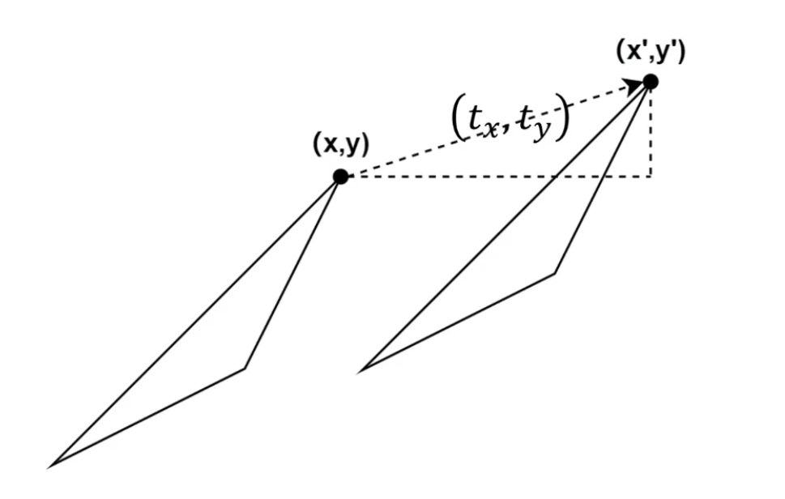
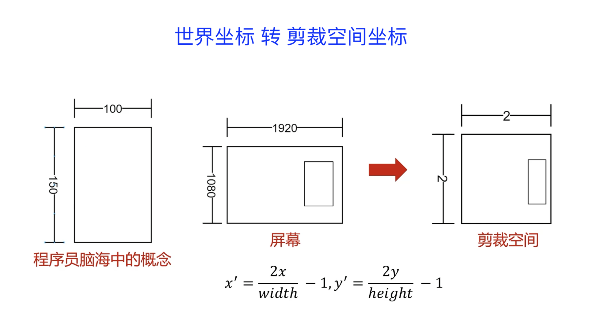
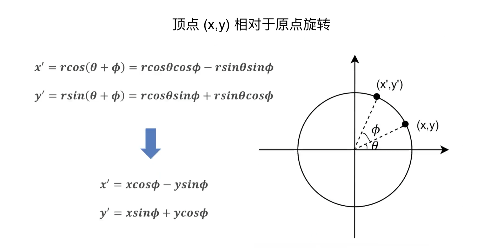
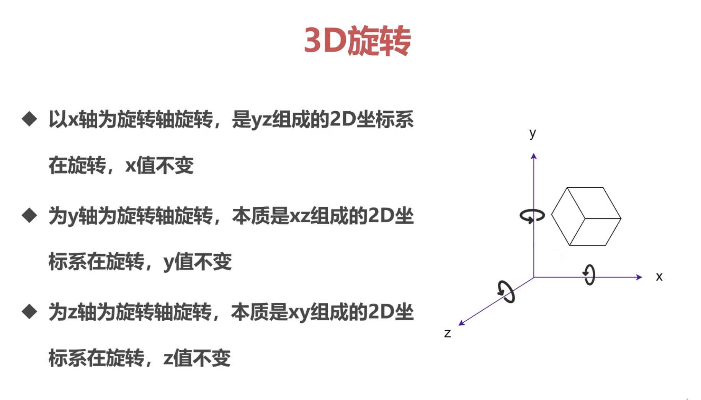

# 空间的平移、缩放、旋转

# 1、二维空间的变换

## 1.1、平移



平移可以使用平移向量 `(Tx,Ty)` 来表示: _每个点都是按照相同的方向移动相同的距离_。

### 使用 `2x2` 矩阵来表示平移

```
/// 没有任何改变
{{1,0},{0,1}} * {x,y} = {x,y};

/// 拉伸矩阵
{{2,0},{0,3}} * {x,y} = {2x,3y};

/// 复合变换
{{1,3},{2,1}} * {x,y} = {x+3y,2x+y};
```

> 二维矩阵不能能完成平移变换！

增加一个纬度，使用三维矩阵来平移：

```
{{1,0,0},{0,1,0},{0,0,1}} * {x,y,1} = {x,y,1};

/// 3D矩阵的平移
{{1,0,2},{0,1,3},{0,0,1}} * {x,y,1} = {x+2,y+3,1};
```

也就是说：二维矩阵的平移需要使用三维矩阵来完成！平移操作可以看作一个矩阵，产生这个矩阵的函数，功能上类似一个高阶函数，可以记做 `(Tx,Ty)`，其中 `T` 是 `Translation` ！

```
/// Tx, Ty 就是待平移的向量 
{
    {1, 0, Tx},
    {0, 1, Ty},
    {0, 0, 1}
}
```

这种增加一个纬度的做法，称之为 __齐次坐标__ (`Homogeneous`) !

使用 _齐次坐标_ 对齐维度，可以使用统一的方法进行计算！

## 1.2、缩放

### 1.2.1、剪裁空间

对于图形引擎，没有太多的屏幕分辨率，仅仅定义了 `[-1, 1]` 的区间范围，跨度为 `2`，这个空间叫做剪裁空间！

图形引擎仅仅处理剪裁空间的数据，所以需要将 _世界坐标_ 转为 _剪裁空间坐标_！



```
/// 矩形在剪裁空间的宽高
100 * (2 / 1920)
150 * (2 / 1080)
/// 由于剪裁空间的坐标是 [-1, 1]`，因此坐标还需要 -1
```

可以使用矩阵变换，将 _世界坐标_ 转为 _剪裁空间坐标_ ！

```
///         缩放                              平移
{{2/w,0,0},{0,2/h,0},{0,0,1}} * {{1,0,-2/w},{0,1,-2/h},{0,0,1}} 
= {{2/w,0,-1},{0,2/h,-1},{0,0,1}};
/// 缩放 * 平移 = 复合变换
```

### 1.2.2、缩放

拉伸缩放的功能可以看作一个生成矩阵的函数，记做 `S(Sx, Sy)`，其中 `S` 是 `Scale`!

```
/// 拉伸缩放矩阵
{
    {Sx, 0 , 0},
    {0 , Sy, 0},
    {0 , 0 , 1}
}
```

## 1.3、旋转

如下图，顶点 `(x, y)` 相对于原点做逆时针旋转！



相对于原点旋转的功能可以看作一个生成矩阵的函数 `R(t)`，其中 `R` 是 `Rotation`!

```
/// 旋转矩阵
{
    {cos(t), -sin(t), 0},
    {sin(t),  cos(t), 0},
    {0     ,      0 , 1}
}
```

> 矩阵不满足交换律，所以在做复合变换时，矩阵的顺序对结果产生直接影响！

__思考__：如何相对于任意点旋转？
* 正方形如何相对于自己的中心点旋转？
* 三角形如何相对于一个顶点旋转？

先将旋转中点移动到原点，然后做旋转，最后再移动回原位置：
* 将旋转中心平移到原点的矩阵 `T(-x,-y)`；
* 旋转矩阵 `R(t)`；
* 将旋转中心平移回原位置 `T(x, y)`；
* 组合起来就是 `T(-x,-y) * R(t) * T(x, y)` ；

# 2、三维空间的变换


## 2.1、平移

类似于二维变换，看做一个产生矩阵的函数`T(Tx,Ty,Tz)` 

```
{
    {1, 0, 0, Tx},
    {0, 1, 0, Ty},
    {0, 0, 1, Tz},
    {0, 0, 0,  1},
}

{{1, 0, 0, Tx},{0, 1, 0, Ty},{0, 0, 1, Tz},{0, 0, 0,  1}} * {x, y, z, 1}
= {x + Tx, y + Ty, z + Tz, 1}
``` 

## 2.2、缩放

类似于二维变换，看做一个产生矩阵的函数`S(Sx,Sy,Sz)` 

```
{
    {Sx, 0, 0, 0},
    {0, Sy, 0, 0},
    {0, 0, Sz, 0},
    {0, 0, 0,  1},
}

{{Sx, 0, 0, 0},{0, Sy, 0, 0},{0, 0, Sz, 0},{0, 0, 0,  1}} * {x, y, z, 1}
= {x * Sx, y * Sy, z * Sz, 1}
``` 

## 2.3、旋转



3D 旋转（逆时针旋转 angle 度）
* 以 X 轴旋转，是 YZ 组成的 2D 坐标系在旋转，x 值不变；
* 以 Y 轴旋转，是 XZ 组成的 2D 坐标系在旋转，y 值不变；
* 以 Z 轴旋转，是 XY 组成的 2D 坐标系在旋转，z 值不变；


### 2.3.1、`X`轴为旋转轴

```
/// t 指的是逆时针旋转的角度
{
    {1,      0,       0, 0},
    {0, cos(t), -sin(t), 0},
    {0, sin(t),  cos(t), 0},
    {0,      0,       0, 1}
}

{{1, 0, 0, 0},{0, cos(t), -sin(t), 0},{0, sin(t), cos(t), 0},{0, 0, 0,  1}} * {x, y, z, 1}
= {x, y * cos(t) - z * sin(t), y * sin(t) + z * cos(t), 1}
``` 

### 2.3.2、`Y`轴为旋转轴

```
/// t 指的是逆时针旋转的角度
{
    { cos(t), 0, sin(t), 0},
    {      0, 1,      0, 0},
    {-sin(t), 0, cos(t), 0},
    {      0, 0,      0, 1}
}

{{cos(t), 0, sin(t), 0},{0, 1, 0, 0},{-sin(t), 0, cos(t), 0},{0, 0, 0,  1}} * {x, y, z, 1}
= {x * cos(t) + z * sin(t), y, z * cos(t) - x * sin(t), 1}
``` 

### 2.3.3、`Z`轴为旋转轴

```
/// t 指的是逆时针旋转的角度
{
    { cos(t), -sin(t), 0, 0},
    { sin(t),  cos(t), 0, 0},
    {      0,       0, 1, 0},
    {      0,       0, 0, 1}
}

{{ cos(t), -sin(t), 0, 0},{ sin(t),  cos(t), 0, 0},{ 0, 0, 1, 0},{0, 0, 0, 1}} * {x, y, z, 1}
= {x * cos(t) - y * sin(t), x * sin(t) + y * cos(t), z, 1}
``` 
