# 音频理论基础

# 1、关于声音的一些知识

## 1.1、声音是如何被听到的？

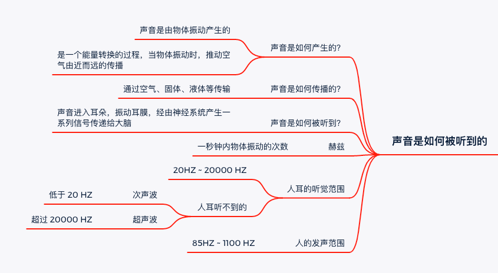

### 1.1.1、声音的产生

> 声音由物体振动产生!

声音的产生是一个能量转换的过程：
* 当物体振动时，
* 推动 _固体、液体、空气_ 等媒介由远而近的传播；
* 进入人耳，振动耳膜，经由神经系统产生一系列信号传递给大脑！

### 1.1.2、人耳的听觉范围与发声范围

> 赫兹 `HZ` ：一秒钟内物体振动的次数

人耳的听觉范围： `[20HZ, 20000HZ]` ！
人发声范围： `[85HZ, 1100HZ]` ！

超过 `20000HZ`的称为 __超声波__ , 低于 `20 HZ`的声音称为  __次声波__ ! 对于超声波与次声波，人耳均听不到！


## 1.2、声音三要素

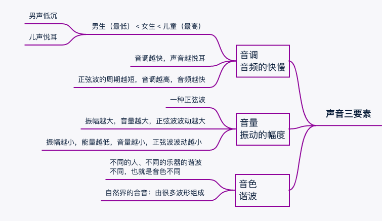

> 声音三要素: 音调、音量、音色！

声音的波形本质一条正弦波！对于一条正弦波，有周期、振幅等指标！
* 正弦波周期越短，音频越快，音调也就越高！
* 正弦波振幅越大，能量越高，音量也就越高！

### 1.2.1、音调

[音调-百度百科](https://baike.baidu.com/item/%E9%9F%B3%E8%B0%83/1669266?fr=aladdin)

> 声音频率的高低叫做音调 `Pitch`: 表示人的听觉分辨一个声音的调子高低的程度。

音调高的声音听起来空灵，清凉，纤细；而音调低的声音听起来雄浑，澎湃，粗犷！

* 频率决定音调: 物体振动的快，发出声音的音调就高；振动的慢，发出声音的音调就低。
* 音调的高低还与发声体的结构有关，因为发声体的结构影响了声音的频率。

儿童的音调最高，其次是女声，最后是男声！表现为儿声悦耳动听，男声低沉！

### 1.2.2、音量

[音量-百度百科](https://baike.baidu.com/item/%E9%9F%B3%E9%87%8F/4277506?fr=aladdin)

> 音量又称音强、响度; 是声音的正弦波振幅大小！


音量是指人耳对所听到的声音大小强弱的主观感受，这种感受源自物体振动时所产生的压力，即声压。
物体振动通过不同的介质，将其振动能量传导开去。
人们为了对声音的感受量化成可以监测的指标，就把声压分成“声压级”，以便能客观的表示声音的强弱，其单位称为 __分贝__ `dB`。
分贝是一种测量声音的相对响度的单位,大约等于人耳通常可觉察响度差别的最小值;人耳对响度差别能察觉的范围,大约包括以最微弱的可闻声为1。


* 正弦波振幅越大，音量越大；
* 正弦波振幅越小，能量越低，音量越小;

声音还有 __遮蔽效应__ ，即当两声音同时发出，其中一个很强，就会掩盖住另一声音，也就是说某一声音越强，声压越大其遮蔽效应就越明显。若__两声音强度相等，则低频声音会显著掩盖高频声音__。


### 1.2.3、音色

[音色-百度百科](https://baike.baidu.com/item/%E9%9F%B3%E8%89%B2/412380?fr=aladdin)

> 音色`Timbre` 是指不同声音表现在波形方面总是有与众不同的特性，不同的物体振动都有不同的特点。

不同的发声体由于其材料、结构不同，发出声音的音色也不同。例如钢琴、小提琴和人发出的声音不一样，不同的人发出的声音也不一样。因此，可以把音色理解为声音的特征。

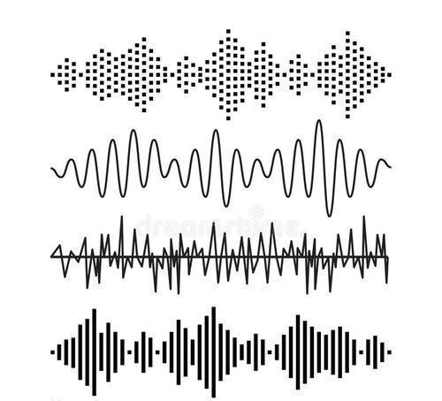

__为什么音色不同__？自然界中的声音本质来说是复合声音，由多种声音交杂一起的！声音由发声体振动产生，当物体振动时会发出基音，同时其各部分也有复合的振动，各部分振动产生的声音组合成泛音！
声音除了有一个_基音_外，还自然而然加上许多不同_频率_（振动的物体1秒钟振动的次数）与泛音 _交织_，就决定了不同的音色，使人听了以后能辨别出是不同的声音。
如同区分不同的 _身份证_ 一样，可以根据某一个人的讲话声或者唱歌声音判断出他是谁!


## 1.3、人耳的遮蔽效应

人耳的遮蔽效应：相信大家都有过这样的经历，在行驶的地铁上接电话，会感到对方的声音很小，即使把音量调到最大，还是听不清 _可以大声点吗？我听不到呀_ ！

我们知道 _声音信号实际是一种能量波_，在空气或其他媒介中传播！即使是同样音量的声音，人们也会因为它们频率不同而感觉到声音大小不同。人耳最容易听到的就是 `4000Hz` 的频率！
即使是音量在相同的情况下，如果音频高于 `4000Hz` 或者低于  `4000Hz`，大家都会觉得声音在变小；但音量降到一定程度时，人耳就听不到了，__每一个频率都有着不同的最低音量值__。

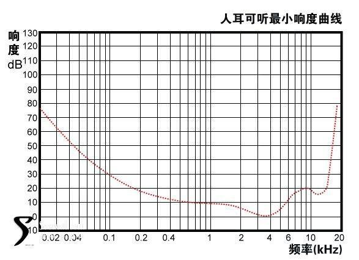


可以看到这条曲线基本成一个 `V` 字型，当频率超过 `15000Hz` 时，人耳会感觉到声音很小，很多听觉不是很好的人，根本就听不到 `20000Hz` 的频率，不管响度有多大。

人耳对遮蔽的反应，来自脑的侦测方式和感受结果，这是音频心理学所研究的主要内容，遮蔽效应简单分两大类：__时域遮蔽效应__ 与 __频域遮蔽效应__  ！


### 1.3.1、频域遮蔽效应

> 不同的声音信号，当音频接近时，高音量的声音将遮蔽低音量的声音！

[遮蔽效应](https://new.qq.com/omn/20210415/20210415A03FMX00.html)

假设遮蔽音是单一频率的纯音，它的遮蔽效果会随着音量变大，遮蔽的频率范围也会变大!
在频域中 `1kHz` 能量强度约`70dB` 的声音讯号会对邻近的三组声音讯号产生遮蔽效应! 因此对于声音讯号而言，__能量的强度将会影响所能遮蔽的范围，当能量愈强时，所能遮蔽的范围也会相对越大__ 。而当一组声音讯号高于屏蔽门槛，在 `0.5kHz` 其能量强度达 `48dB` 时，此声音讯号便又会被人耳察觉。

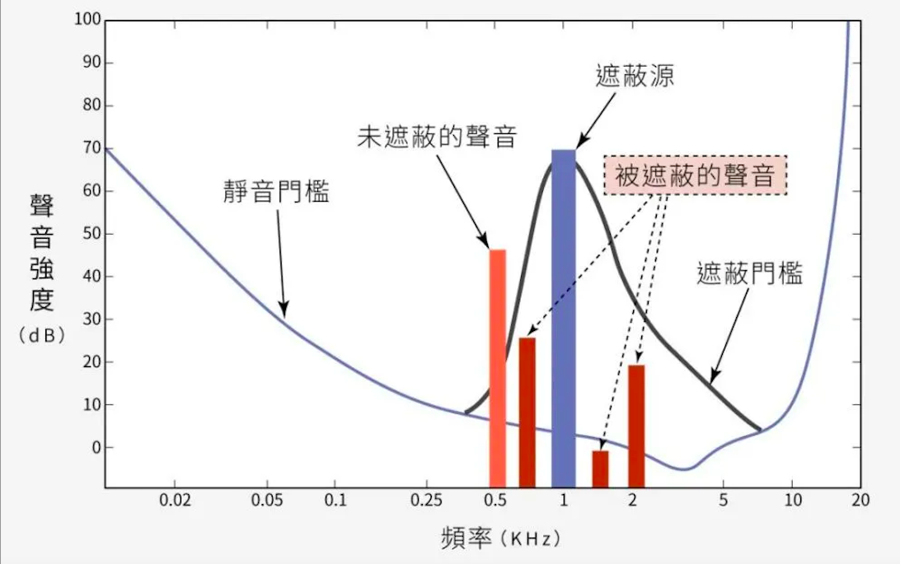

一般来说，弱纯音频率相隔强纯音频率愈接近，就愈容易被掩蔽。因为人脑对听觉有这种遮蔽的反应，而多数的噪音也不只是单一的频率音，所以就会把某个范围的频率也遮蔽了。


### 1.3.2、时域遮蔽效应

由于大脑处理声音信息需要花费一定的时间，此时就会产生__时域遮蔽__！
时域遮蔽效应指在时间上相邻的声音之间也有掩蔽现象，其可分为前遮蔽 、同步遮蔽、后遮蔽。
一般来说：前遮蔽只有大慨 `50ms`，而后遮蔽一般可以持续达 `200ms`。

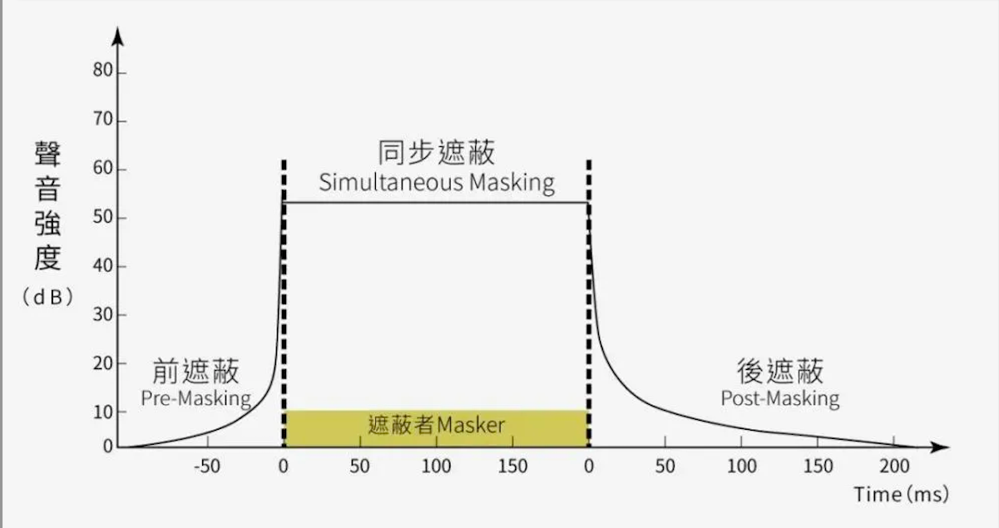

后遮蔽：如果一个高音量声音后面紧跟着一个低音量声音，而时间差在 `200ms` 之内，低音量声音就很难听到；
前遮蔽：在低音量声音后紧跟着一个高音量声音，而时间在 `50ms` 之内，那么低音量声音也是很难听到。
当然这个对强弱音的音压差距也会产生不同的遮蔽程度。


### 1.3.3、消除冗余信息

思考一下：既然频域遮蔽与时域遮蔽过滤了那么多的声音，最终才被大脑感知，那么我们还有必要采集这些被遮蔽的声音吗？

在做音频采集时，根据遮蔽效应，可以将这些冗余信息全部剔除掉，减小数据规模！

### 1.3.4、白噪音与粉噪音


# 2、声音信号的采集

## 2.1、模数转换


[声音是怎么被量化的](https://zhuanlan.zhihu.com/p/350031004)


> 模拟信号只有通过 `A/D` 转化为数字信号后才能用软件进行处理，这一切都是通过 `A/D` 转换器`ADC`来实现的!

###### 模拟信号

自然界的声音表现为连续的、平滑的波形，其横坐标为时间轴，纵坐标表示声音的强弱。

模数变换主要是 __对模拟信号进行采样，然后量化编码为二进制数字信号__；数模变换是模数变换的逆过程！

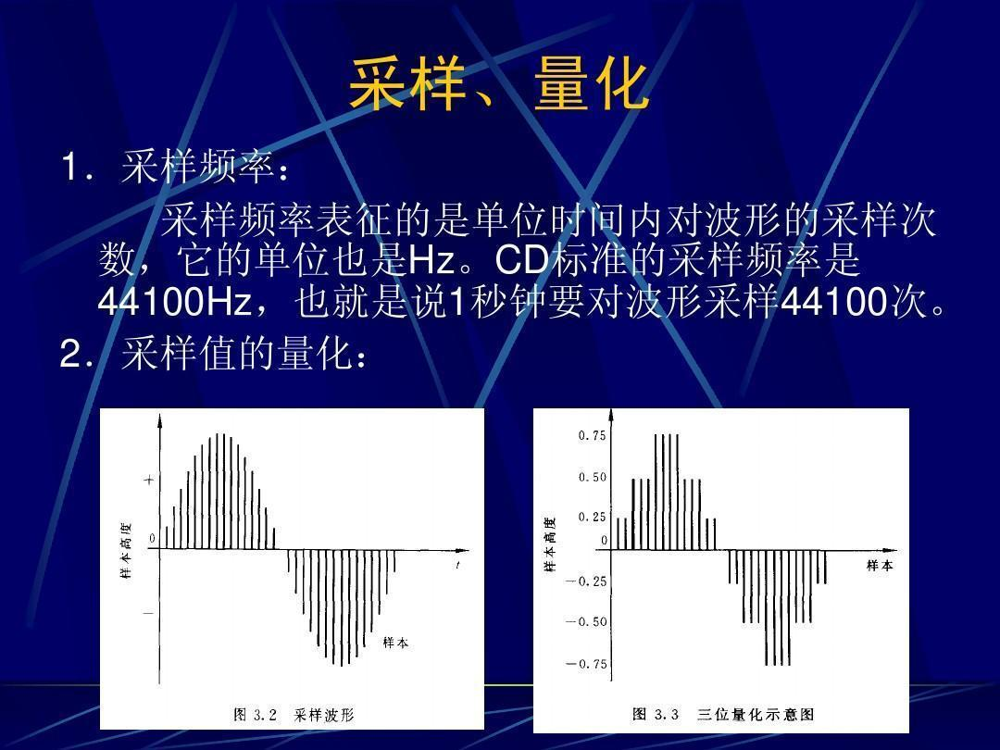


###### 编码

将每个量化后的样本值转换成二进制编码。

######  数字信号

将所有样本二进制编码连起来存储在计算机上就形成了数字信号。

## 2.2、量化的基本概念

> 位深、采样率、声道数是采集声音信号的三要素

### 2.2.1、位深

位深也就是采样大小：一个采样使用多少个bit存放，常用的是`16bit` (这就意味着量化过程中，纵坐标的取值范围是 `0-65535`，声音是没有负值的)。

* 位深越高、描述的峰值越大；对声音波形的强度，描述的越清楚 ！


### 2.2.2、采样率

每秒钟采样的次数称为采样率！一般的采用率有：48K/秒、44.1K/秒、32K/秒、16K/秒、8K/秒！而我们经常使用的是采样率是 48K/秒 ！

采样率越高，声音的还原就越真实越自然，当然数据量就越大。

### 2.2.3、声道数

为了播放声音时能够还原真实的声场，在录制声音时在前后左右几个不同的方位同时获取声音，每个方位的声音就是一个声道。声道数是声音录制时的音源数量，有单声道、双声道、多声道。

### 2.2.4、码率

码率（比特率）: 是将模拟声音信号转换成数字声音信号后，单位时间内的二进制数据量，是间接衡量音频质量的一个指标，单位为 `bps (Bit Per Second)`。 

* 码率越高，每秒传送数据就越多，音质就越好；声音就越清晰！

码率计算公式： 

```
码率 = 采样率 * 采样大小 * 声道数
/**
比如采样率 48 kHz，采样大小为 16 bit，双声道编码的 PCM 文件

码率 = 48kHz * 16bit * 2 = 1536 kbit/s
*/
```

码率为 `1536 kbit/s` 那么一分钟下来采集的数据大小为  `(1536  * 1000 * 60) / 8 / 1024 / 1024 = 10.98 M`。


对于一个音频来说，如此大的数量显然会堵塞网络！在网络传输之前需要数据压缩 !

> 码流越大，存储的信息量越多，清晰度越高，保真性就越高；
> 码流越小，去除的冗余信息就越多，去除的冗余信息有可能对声音造成不可逆的损伤！

## 2.3、音频原始数据


* PCM ：最原始的音频数据，没有任何格式！
* WAV ：既可以存储原始 PCM 数据，也可以存储压缩数据！大部分情况下使用 WAV 存储 PCM 数据，也就是说 WAV 是在 PCM 的数据之上套了个数据头，数据头包含一些基础信息


### 2.3.1、 WAV Header

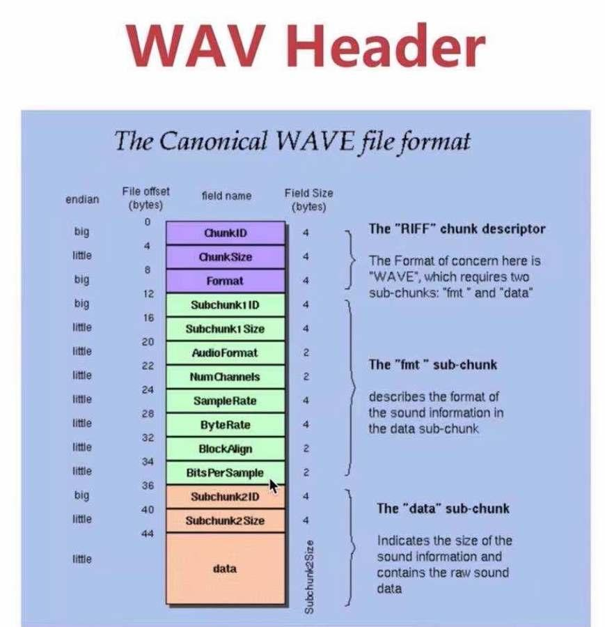

###### `RIFF` ：数据块大小与格式

* `Chunk ID`
* `Chunk Size`
* `Format` ：后面跟着数据信息

* `Subchunk1 ID`
* `Subchunk1 size`
* `Audio Format`
* `Num Channels` ：声道数
* `SampleRate` ： 采样率
* `ByteRate` ： 采样率的字节数，`位深除以 8 再乘以采样率`
* `BlockAlign` ： 快对齐，是 2 个字节，还是 4 个字节，一般都是偶数
* `BitsPer Sample` ： 位深，采样大小

###### 数据部分

* `Subchunk2 ID`
* `Subchunk2 size`
* `data`

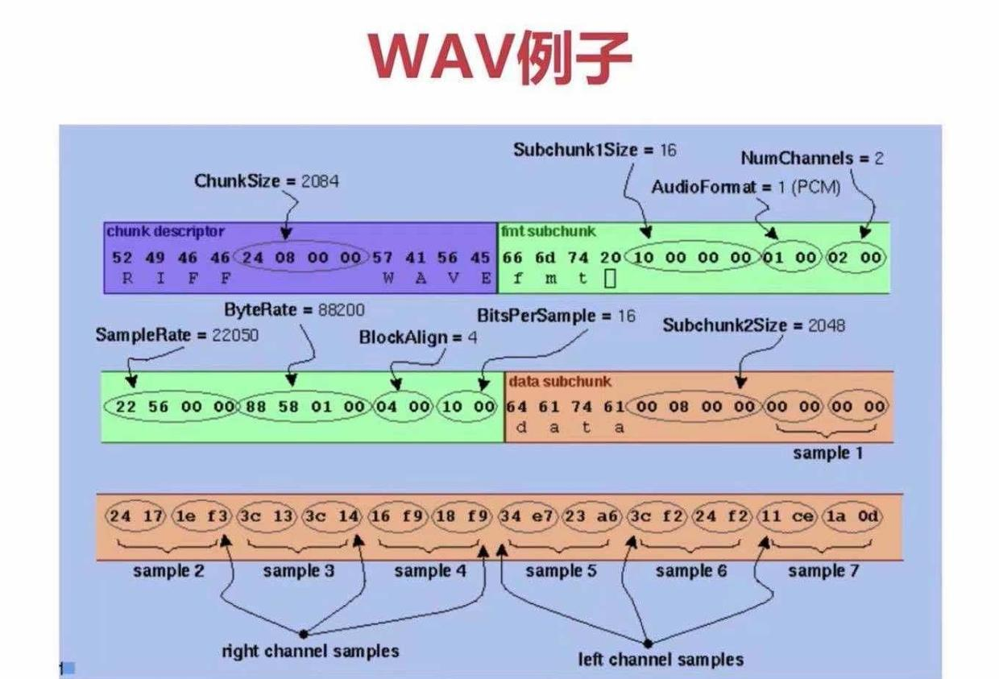


### 2.3.2、使用 `ffmpeg` 通过终端采集音频数据


```
///  采集音频数据 (control+c 停止采集)
ffmpeg -f avfoundation -i :0 out.wav
```
* `macOS` 系统下使用  `avfoundation` 库采集；
*  `-i` 从哪采集？ `:0` 表示 `:` 前表示视频， `:`表示音频！


```
///  播放音频数据
ffplay out.wav
```


# 3、音频压缩技术

对于采集的原始 `PCM` 数据，每秒钟采集的数据超过 `1M` 多；在实时通讯场景下还有视频数据，显示不适合做网络传输，需要对音频做一个数据压缩！

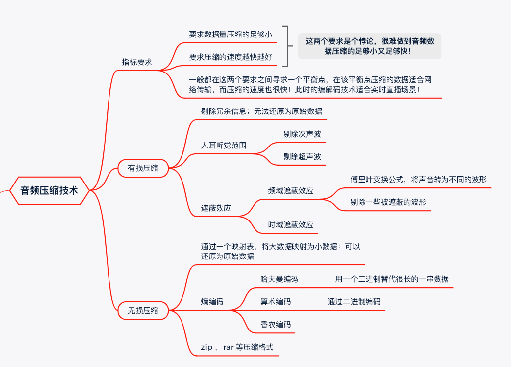

针对音频数据的压缩，既要求数据量压缩的足够小，又要求压缩的速度越快越好！但这两个要求是个悖论，很难做到音频数据压缩的足够小又足够快！一般都在这两个要求之间寻求一个平衡点，在该平衡点压缩的数据适合网络传输，而压缩的速度也很快！此时的编解码技术适合实时直播场景！

__音频压缩技术__ 是在保证信号在听觉方面不产生失真的前提下，对音频数据信号进行尽可能大的压缩！
压缩的主要方法是去除采集到的冗余信息：所谓的冗余信息包括人耳听觉范围之外的音频信号以及被遮蔽掉的信号（频域遮蔽与时域遮蔽效应）。
消除冗余信息属于有损压缩，无法还原为原始数据！在消除冗余信息之后，还可以进一步做无损压缩：如`zip` 、`rar` 等！

## 3.1、 有损压缩


## 3.2、 无损压缩

[熵编码](https://baike.baidu.com/item/%E7%86%B5%E7%BC%96%E7%A0%81/3303605?fr=aladdin)

复合声音：各种声音掺杂在一起；

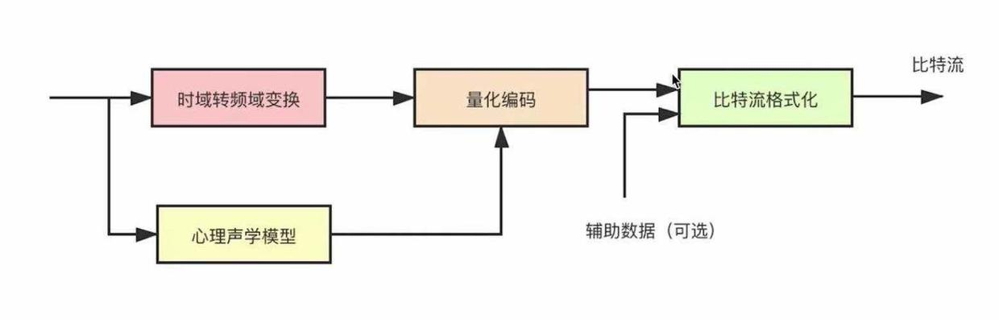

## 3.3、音频编码器


常见的音频编码器包括 `OPUS`、`AAC`、`Ogg`、`Speex`、`iLBC`、`ARM`、`G.711` 等！
*  `OPUS`: 延迟小、压缩率高；目前实时通讯如在线教育、音视频会议，基本都使用`OPUS`；
*  `AAC`: 目前应用最广泛的编解码器；如iOS 、安卓等嵌入式设备，都包含硬件的 `AAC` 编解码器；还有软 `AAC` 编解码器，如 ffmpeg 自身包含的 `AAC` 编解码器等； 取代了 `MP3`, 广泛用于娱乐直播系统；
*  `Ogg`: 收费，应用不广泛；
*  `Speex`: 当初包括回音消除功能，曾经很流行；
*  `G.711`: 窄带音频，一般用于固话；声音损耗严重，容易失真；保真性要求高的音乐等，不适合使用 `G.711` ！

网上评测结果： OPUS > AAC > Ogg !

### 3.3.1、不同网络的影响

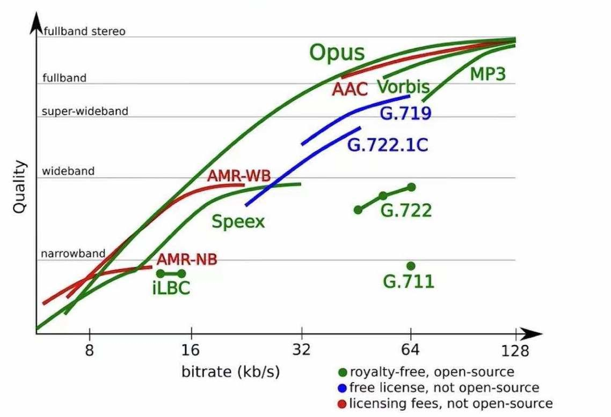

从上图分析出，不同的编解码器对网络等基础设施有密切关系
*  `OPUS`: 跨度非常大，在不同的音频质量下可以有不同的码流；窄带音频，会压缩的非常高，码流下降；而对于宽带音频，拥有非常高的音质，可以达到非常大的码流；
*  `AAC`: 相对于  `OPUS` 来讲，没有那么大的跨度，属于全带音频；要求码流在 32 k以上到 128 k 这个范围；
*  `G.711`: 窄带音频，编码后的数据流也很大；


### 3.3.2、延迟性对比

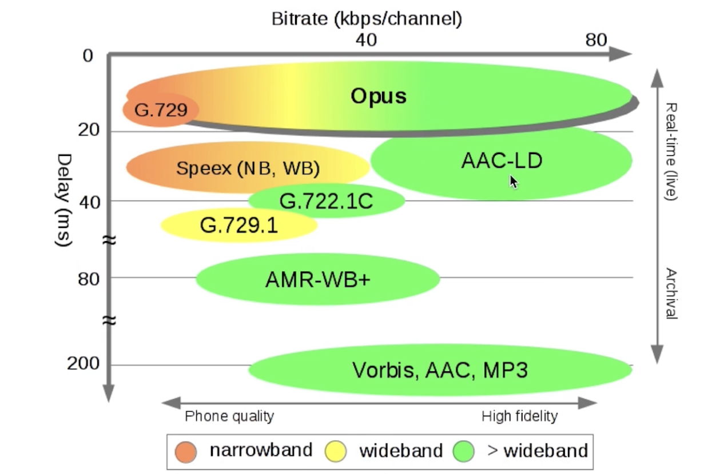

延迟越低，相对来说，码流越小！
* `OPUS` 的延迟性最低，只有不到 20 ms；而它的码流可以达到 0~ 80 这个范围；
* `AAC` 的延迟率就高于`OPUS`，达到了  20 ms 以上；不适合做实时通讯，适用于有一定延迟的娱乐直播系统；


## 3.4、`AAC` 编解码器

### 3.4.1、`AAC` 发展背景

AAC（Advanced Audio Coding），中文名：高级[音频编码](https://baike.baidu.com/item/%E9%9F%B3%E9%A2%91%E7%BC%96%E7%A0%81/1729208)。出现于1997年，基于[MPEG-2](https://baike.baidu.com/item/MPEG-2)的音频编码技术。由[Fraunhofer IIS](https://baike.baidu.com/item/Fraunhofer%20IIS)、[杜比实验室](https://baike.baidu.com/item/%E6%9D%9C%E6%AF%94%E5%AE%9E%E9%AA%8C%E5%AE%A4/928796)、[AT&T](https://baike.baidu.com/item/AT%26T)、[索尼](https://baike.baidu.com/item/%E7%B4%A2%E5%B0%BC/999090)等公司共同开发，目的是取代[MP3](https://baike.baidu.com/item/MP3/23904)格式。


AAC 是一种专为声音数据设计的文件压缩格式。与MP3不同，它采用了全新的算法进行编码，压缩率更高，压缩后的数据更小；保真性好，音质更佳！

最开始时是基于 `MPEG-2` 的音频编码技术， `MPEG-4` 标准出现后，`AAC `重新继承了其特性，加入了 `SBR` 技术和 `PS` 技术！

### 3.4.2、`AAC` 技术规格

目前常用的规格有：`AAC LC` 、`AAC HE V1` 、 `AAC HE V2` ！

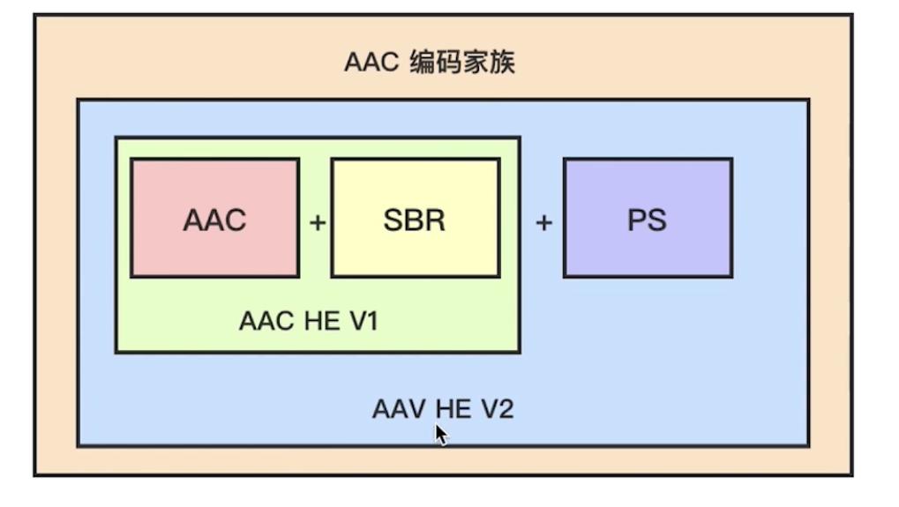


* `AAC LC`  ：最基础的技术，低复杂度规格，码流为 `128` K，音质好；
* `AAC HE V1`  ：等于 `AAC LC + SBR`！其核心思想是按频谱保存，声音通过傅里叶变换将时域转为频域之后有了各种频谱（不同频域的声音叠加在一起形成的频谱）；低频编码保存声音的主要成分，高频单独放大编码保存音质！码流大大减少，在 `64 K` 左右！
* `AAC HE V2` ： 等于 `AAC LC + SBR + PS`，核心思想是双声道中的声音存在某种相似度，只需存储一个声道的全部信息；然后花很少的字节用参数描述另一个声道和它不同的地方！ 相对来说，`AAC HE V2`  与  `AAC HE V1` 的码流差距不是太大！


### 3.4.3、`AAC` 格式

* `ADIF` ：可以看做`AAC`数据加了一个头；播放 `AAC` 数据时需要先解析这个头，拿到`AAC`数据的各种参数，通过这些参数解码 `AAC` 数据，然后播放！`ADIF`格式只能从音频头部开始解码，不能从音频数据流中间开始，常用于磁盘文件中！
* `ADTS` ：每一帧都有一个同步字，可以在音频流的任何位置开始解码，开始播放；类似于数据流格式 ！`ADTS` 数据量要比 `ADIF`  的数据量大很多


`ADTS` 由 7 个字节或者 9 个字节组成！A~Q 每个字符分别代表1个bit位。AAC前面均包含ADTS头，按位可以节省很多内存。

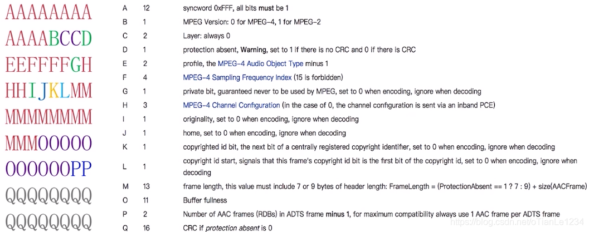

* `Audio Object Types`(音频对象类型): 序号从 `1` 开始，真正编码中需要减 `1` 作为真实的 `type`，解析时需要加 `1` ；常见如下：`1代表AAC Main`、`2`代表`AAC LC`、`5`代表`SBR`、`29`代表`PS`；
* `Sampling Frequency Index(采样率编号)` : `0：96000 HZ`、 `1：88200HZ`、 `2：64000HZ`、 `3：48000HZ`、`4：44100 HZ`、 `5：32000HZ`、 `6：24000HZ` 、`7：22050HZ`、`8：16000 HZ`、 `9：12000HZ`、 `10：11025HZ`、 `11：8000HZ`、`12：7350 HZ`、 `13：Reserved`、 `14：Reserved`、 `15：48000HZ`；


[AAC Header](https://www.p23.nl/projects/aac-header/)


### 3.4.4、使用 ffmpeg 生成 `AAC` 数据

[libfdk_aac 使用文档](http://www.ffmpeg.org/ffmpeg-codecs.html#libfdk_005faac)

```
ffmpeg -i demo.mp4  /// 待抽取的资源
      -vn -c:a libfdk_aac /// -vn (video no 过滤视频)、 -c:a (codec:audio) 指定音频编解码器 libfdk_aac
      -ar 44100 -channels 2 -profile:a aac_he_v2 hello.aac // -ar 音频采样率、 -channels 通道数、 -profile 额外参数
      
      
MacBook $ ffmpeg -i demo.mp4 -vn -c:a libfdk_aac -ar 44100 -channels 2 -profile:a aac_he hello.aac
MacBook $ ffplay hello.aac 
[aac @ 0x7fb24ad86180] Estimating duration from bitrate, this may be inaccurate
Input #0, aac, from '/Desktop/hello.aac':
  Duration: 00:00:07.81, bitrate: 48 kb/s
  /// 采样率 44100 声道数 stereo（单声道） mono （双声道） 码流 48 kb/s ； HE-AACv2 v2 版本
  Stream #0:0: Audio: aac (HE-AACv2), 44100 Hz, stereo, fltp, 48 kb/s 
  10.19 M-A:  0.000 fd=   0 aq=    0KB vq=    0KB sq=    0B f=0/0   
  
MacBook $ ffplay -ar 44100 -ac 2 -f f32le demo.pcm
```


### 音频重采样

将音频三元组（采样率、采样大小、通道数）的值转为另一组值，如将 `44100/16/2` 转成 `48000/16/2` ! 

##### 为什么要重采样？

* 从设备采集的音频数据与编码器要求的数据不一致；
* 扬声器要求的音频数据与要播放的音频数据不一致；
* 更方便计算（回音消除）


##### 如何知道是否需要重采样？

* 了解音频设备的参数：采样率、位深、通道数
* 查看 `ffmpeg` 源码


##### 重采样的步骤

* 创建重采样上下文；
* 设置相关参数；
* 初始化重采样；
* 进行重采样；

```
/// 1、创建上下文
/// 2、设置参数
struct SwrContext *swr_alloc_set_opts(struct SwrContext *s,
                                      int64_t out_ch_layout, enum AVSampleFormat out_sample_fmt, int out_sample_rate,
                                      int64_t  in_ch_layout, enum AVSampleFormat  in_sample_fmt, int  in_sample_rate,
                                      int log_offset, void *log_ctx);
                                      
int swr_init(struct SwrContext *s); /// 初始化

/// 音频帧的转换
int swr_convert(struct SwrContext *s, uint8_t **out, int out_count,
                                const uint8_t **in , int in_count);

void swr_free(struct SwrContext **s);
                      
```


####  音频数据流的流转过程

`PCM -> aac/mp3 -> mp4/flv`
`PCM <- aac/mp3 <- mp4/flv`

采集的原始数据 `PCM` ，经过编码编为 `aac/mp3` 等格式，生成多媒体文件 `mp4/flv`；
多媒体文件 `mp4/flv` 等取出音频文件`aac/mp3` ，经过解码器解码为 `PCM` ！


